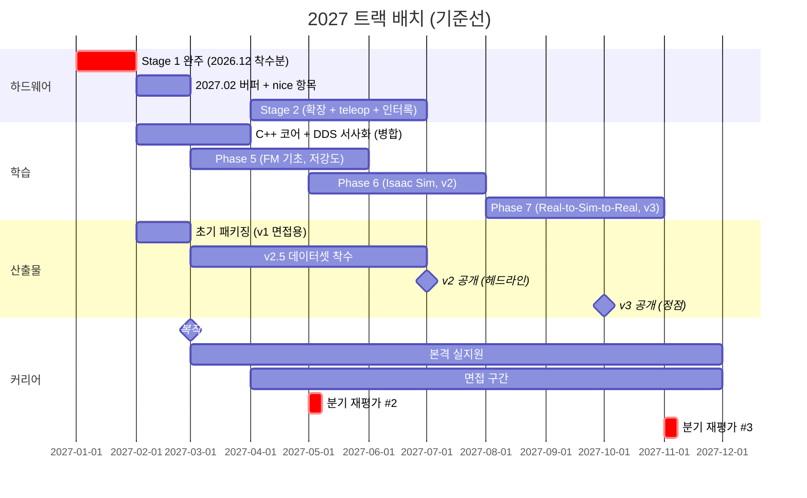

# 2027 실행 가이드 (1월 - 12월)

> 작성일: 2026-08-12
> 대상: 2027 의 5개 트랙 배치 — 학습 (Phase 5·6·7) / 하드웨어 (Stage 1·2) / 산출물 (v2, v2.5, v3) / 커리어 (복직·본격 실지원) / 스택 gap (C++·DDS·디버깅)
> 사유: [2026 하반기 실행 가이드](2026-07-28-year-end-execution-guide.md) 가 12월에서 끝나 그 이후의 총부하·게이트·산출물 소비 시점이 보이지 않는다. 복직(2027.03)과 실지원이 학습과 처음 겹치는 해라 배타 배치가 필요한 구간이 여러 개다
> 성격: **개관 문서 (체크박스 없음)**. 일상 체크는 [remediation plan](2026-07-07-repo-review-remediation.md) §실행 보드에서만 한다
> 상태: **기준선** — 2027 항목은 전부 분기 재평가 #1 (2026.11) 이후에 실행된다. 재평가 #1·#2 (2027.05)·#3 (2027.11) 결과로 갱신한다

## 0. 이 문서의 지위

2026 하반기 가이드와 같다 — 배치·부하·결정 지점만 보여주는 읽기 전용 지도이고, 항목의 정의와 통과 기준은 원본에 있다.

| 원본 | 담당 범위 |
|---|---|
| [Roadmap/Hardware-Arm.md](../../../Roadmap/Hardware-Arm.md) | Stage 1·2 의 단계·완료 체크리스트 (must/nice 분해) |
| [Roadmap/Phase 5.md](../../../Roadmap/Phase%205.md) | Foundation Model 기초 (ViT/CLIP/DINOv2/SigLIP) |
| [Roadmap/Phase 6.md](../../../Roadmap/Phase%206.md) | Isaac Sim 디지털 트윈 -> 산출물 v2 (헤드라인) |
| [Roadmap/Phase 7.md](../../../Roadmap/Phase%207.md) | Real-to-Sim-to-Real -> 산출물 v3 (정점) |
| [career positioning spec](../specs/2026-08-05-career-positioning-vla-edge-design.md) §6.2 | 스택 gap 트랙 배치와 대체 대상 |
| [README.md](../../../README.md) 초기 패키징 절 / 부록 B / 부록 D / 부록 E | 패키징 범위 / 산출물 정의 / 재평가 #2·#3 안건 / fallback 착지점 |

**이 문서가 확정하지 않는 것**: 2027 배치의 전제 몇 개가 아직 미결이다 — Stage 2 확장 수단 (2026.11 결정), 스택 gap 트랙 편입 여부 (2026.11), 동역학 라잇 트랙 편입 여부 (2026.11), 2027.01 조기 지원 여부 (2026.11), Stage 1 12월 착수의 되돌림 조건 확인 (2026.11). 여기서는 **현재 로드맵을 시간축에 편 기준선**만 제시한다.

## 1. 결론 먼저

1. **2027 의 축은 복직 (03) 과 본격 실지원이다.** 학습 트랙은 전부 "실지원 병행 저강도" 로 내려간다 — 2026 까지 유효했던 "한 구간 메인 1트랙" 이 여기서 성격을 바꾼다.
2. **Stage 1 본 빌드는 2026.12 에 착수해 2027.01 에 완주한다.** 2027.02 는 초기 패키징 단독 구간이자 지연 흡수 버퍼다 — 첫 하드웨어가 추정의 2-3배 걸린다는 전제 위에서 must 마감 (2027.02 말) 앞에 한 달을 비워 둔 배치다 (§3.1).
3. **첫 서류가 소비하는 실물 증거는 Stage 1 must 하나뿐이다.** v2 는 2027.07, v3 는 2027.10 이라 2027.03 첫 웨이브에 들어가지 않는다. 이 비대칭이 지원 시퀀싱 판단의 근거다 (§5, §6.2).
4. **C++ 의 실질 마감은 서류가 아니라 코딩테스트다** (지원 후 2-4주, 2027.03 말-04 초). 그래서 C++ 코어와 DDS 서사화는 2027.02 말-03 에 병합 배치한다 — 둘 다 "이미 쓰던 것의 언어화" 성격이고 면접 직전일수록 신선하다.
5. **연쇄 게이트가 3개 있다.** 스파이크 결과 (2026.10) -> Stage 1 착수 (2026.12) / Stage 1 must (마감 2027.02 말) -> 서류 (2027.03) / Stage 2 확장 수단 (2026.11 결정) -> Phase 6·7. 앞이 밀리면 뒤가 통째로 밀린다.

## 2. 전제와 제약

| 항목 | 값 | 출처 |
|---|---|---|
| 육아휴직 | 2026.09-2027.02. **복직 2027.03** | 결정 #4 |
| 가용 시간 | 휴직 구간 (-2027.02) 은 2026 가정 (월 30-35h) 을 승계. **복직 후 (2027.03-) 는 미검증** — 재산정 대상 | year-end guide §2 |
| 트랙 원칙 | 2027.02 까지는 메인 1트랙. 2027.03 부터는 실지원이 메인이고 학습은 병행 저강도 | README 전체 로드맵 |
| GPU | RTX 4070 12GB / RAM 31GB, 증설 불가. Isaac Sim 5.x 최소 사양 (16GB/32GB) 미달 — GUI 워크로드는 RunPod 이관 불가 (UDP 미지원) | 결정 #5 |
| 학습 컴퓨트 | LoRA·GR00T 급은 RunPod. ACT (LeRobot, 소형) 는 로컬 4070 가능 | career spec §1.2 |
| 하드웨어 | SO-101 리더-팔로워. 키트·손목 카메라·작업대 자재는 2026.09 일괄 확보, 드라이버 경로는 2026.10 스파이크에서 검증, 조립은 2026.12 착수 | Hardware-Arm.md |
| 지원 원칙 | 휴직 중 구직 지원 없음 (정찰 포함). 본격 실지원은 복직 직후 개시 | README 전체 로드맵 |

## 3. 구간별 진행

### 3.1 2027.01-02 (휴직 잔여 — Stage 1 완주 + 패키징)

| 트랙 | 항목 | 추정 |
|---|---|---|
| 하드웨어 | **Stage 1 완주 (01)** — 2026.12 착수분(조립 + URDF + 드라이버)에 이어 위치 제어 + pick-and-place + teleop 확인 + 1분 영상 마감 | Stage 1 전체 35-55h 중 잔여 |
| 커리어 | **초기 패키징 (02, 단독 구간)** — v1 을 면접 진입점으로 재구성, 포트폴리오 repo 정비, 이력서 국/영문, 지원 트래커. 공백기 답변 골자와 산출물별 결정 근거 요약까지 | 2-3주 |
| 학습 | ACT-Diffusion-VLA 정책 계보 라잇 정리 노트 (면접 방어용, 학습 아님) | 소 |

**2027.02 는 버퍼를 겸한다.** Stage 1 이 1월에 안 끝나면 여기서 흡수하고, 여유가 남으면 nice 2건 (Isaac Sim 임포트, LeRobot ACT 1회) 에 쓴다. 12월 착수 전진 (year-end guide §6.2) 이 만든 여유가 이 자리다.

**이 구간에 스택 gap 트랙을 넣지 않는다.** 재평가 #1 에서 스택 gap 편입을 결정할 때 이 배치의 성립 여부를 함께 판단한다 (career spec §6.2).

Stage 1 은 must/nice 로 나뉘어 있고 **서류가 소비하는 것은 must 뿐**이다 (완주 목표 2027.01 말 / 최종 마감 2027.02 말). nice 2건은 마감이 서류가 아니라 후속 Phase 다.

- nice 1: Isaac Sim URDF 임포트 + Joint State 매칭 -> 로컬 사양 미달 시 Phase 6 (2027.05-) 로 이월
- nice 2: LeRobot ACT 1회 학습 -> 2027.03 v2.5 착수 구간으로 이월 허용

2027.01 조기 지원이 재평가 #1 에서 결정되면 패키징을 1월로 당겨야 해 Stage 1 마무리와 겹친다. 12월 착수 전진으로 압박은 줄었지만 해소되지는 않는다 (§6.1).

### 3.2 2027.02 말-03 (C++·DDS 병합 + 복직 + 실지원 개시)

| 트랙 | 항목 |
|---|---|
| 스택 gap | **C++ 코어 + DDS/ROS2 내부 서사화 병합** (2-3주). C++ 은 RAII·스마트 포인터·동시성으로 좁게. DDS 는 QoS 정책별 동작, discovery 가 노드 증가 시 터지는 이유, rmw 교체 이유, 대역폭 큰 토픽의 병목 — 기존 5년 장애 경험과 연결해 서사화 |
| 커리어 | **복직 (03) + 본격 실지원 개시.** 트리거는 "v1 + 스파이크 + Stage 1 must 확보 = 면접장에 들어갈 만큼" |
| 면접 준비 | 코어 서사 5개 추출 (QoS, discovery, 대역폭, 배포, 장애 복구 — 원리 설명 포함) + C++ 방어 |
| 산출물 | **v2.5 착수** — SO-101 teleop 데이터셋 수집 개시 (LeRobot 포맷, HF Hub 공개 목표) |
| 학습 | Phase 5 (FM 기초) 착수 — 스택 gap 편입 시 이 항목이 대체 대상이라 2027.03 이후로 순연된다 |

DDS 트랙의 효율이 가장 높은 이유는 새로 배우는 것이 아니라 **기존 5년 경험이 소급해서 깊이 있는 서사로 바뀌는** 성격이기 때문이다. 제로에서 배우는 사람과 투입 대비 효과가 다르다.

### 3.3 2027.04-06 (Stage 2 + 면접 구간)

| 트랙 | 항목 |
|---|---|
| 하드웨어 | **Stage 2 (3개월)** — 확장 수단 적용 (2026.11 결정) + URDF 갱신 / teleop 입력 + 데이터 수집 파이프라인 + 카메라-팔 base 캘리브 / **안전 인터록 (C++ 노드)** + Sim 물리 파라미터 매칭 |
| 스택 gap | 디버깅 도구 (gdb 코어 덤프, sanitizer, perf) — 인터록 노드 제작 과정에서 곁다리로. 1-2일 x 3개 |
| 커리어 | 첫 면접 구간 (현실적으로 04 이후 — 03 지원 + 프로세스 1개월). 분기당 면접 2-3건 목표 |
| 학습 | Phase 5 잔여 (저강도) |
| 재평가 | **분기 재평가 #2 (2027.05)** — 실지원 면접 결과 누적 / Phase 5 종료 시점 / Stage 2 완성도 + v2 진행률 / VLA 모델 갱신 검토 (OpenVLA 유지 or π0·Helix·GR00T) / 콘텐츠 반응 추이 |

**Stage 2 의 안전 인터록 (C++) 이 스택 gap 전략의 실증 카드다.** "성능·안전이 필요한 지점은 C++ 로 내려간다, 실제로 내려가봤다" 는 서사이며, 없는 5년을 지어내는 것보다 진짜 증거 1개가 강하다는 판단에 근거한다.

주의 하나 — Phase 6 원안 (2027.05-07) 이 Stage 2 (2027.04-06) 와 한 달 겹친다. Phase 6 은 Stage 2 의 6DOF 팔과 Sim 물리 파라미터 매칭을 입력으로 받으므로, 겹치는 05 월에는 Phase 6 을 Isaac Sim 환경 구축 (팔 비의존 부분) 으로 한정한다.

### 3.4 2027.07-09 (v2 -> Phase 7 착수)

| 트랙 | 항목 |
|---|---|
| 학습 | **Phase 6 마무리 -> 산출물 v2 공개 (헤드라인)** — Isaac Sim 디지털 트윈 + 자작 팔 결합 + sim-to-real gap 수치. v1 에서 이관한 블로그·1분 영상·외부 공개가 여기서 함께 집행된다 |
| 학습 | **Phase 7 착수 (08-)** — Real-to-Sim-to-Real, 산출물 v3 |
| 커리어 | 실지원 2차 웨이브 판단 지점 — v2 합류로 카드가 바뀐다 (§6.2) |

v2 는 이 로드맵의 헤드라인 산출물이고, **외부 공개 기준으로는 사실상 첫 대형 카드**다 (v1 은 레포 기록, v1.5 는 sim adaptation). 2027.07 이라는 시점이 첫 서류 (2027.03) 보다 4개월 뒤라는 점이 지원 시퀀싱의 핵심 제약이다.

### 3.5 2027.10-12 (v3 + 3차 재평가)

| 트랙 | 항목 |
|---|---|
| 학습 | **Phase 7 마무리 -> 산출물 v3 공개 (차별화 정점)** — OpenVLA fork + ROS2 + 자작 6DOF + 디지털 트윈 + 안전 인터록 + latency |
| 재평가 | **분기 재평가 #3 (2027.11)** — 누적 면접 결과 / 시장 매칭 시그널 / 콘텐츠 반응 / **2028.03 fallback 진입 여부** (착지점: README 부록 E) / Jetson 실기 배포 옵션 진입 여부 |
| 커리어 | 이직 실현 레인지 시작 (2027 말-2028) |

## 4. 트랙 뷰

## 5. 산출물과 서류 소비 시점

| 산출물 | 완성 | 첫 웨이브 (2027.03) 에 쓸 수 있나 | 성격 |
|---|---|---|---|
| v1 (zero-shot + ROS2 dry-run) | 2026.10 | 가능 (레포 기록 + 패키징) | 통합·배포 증거 (셋째 층) |
| v1.5 (LoRA adaptation + eval) | 2026.08-09 | 가능 (블로그 + vla-lab) | adaptation 증거 (둘째 층) |
| 실측 write-up (int4 latency) | 2026.09 | 가능 (vla-lab 공개) | 측정 방법론·제약 계산 |
| Stage 1 must (자작 팔 동작 + 영상) | 2027.01 (마감 2027.02 말) | 가능 — **서류가 소비하는 유일한 real 증거** | Brain-Body 통합 실물 |
| v2.5 (teleop 데이터셋) | 2027.03 착수 | 불가 (착수 시점) | LeRobot/HF 파이프라인 경험 |
| **v2 (sim-to-real gap, 헤드라인)** | 2027.07 | **불가** | 헤드라인 카드 |
| **v3 (Real-to-Sim-to-Real, 정점)** | 2027.10 | **불가** | 정점 카드 |

즉 첫 웨이브는 **sim 증거 3개 + 실물 1개**로 들어간다. 헤드라인과 정점 카드는 그 뒤에 붙는다. 이 구조가 §6.2 지원 시퀀싱의 근거다.

## 6. 결정 지점

### 6.1 2027.01 조기 지원 여부 (재평가 #1, 2026.11 에서 결정)

사후지급금 폐지로 휴직 중 지원의 경제 페널티가 사라졌고 채용 프로세스가 1-3개월이라, 2027.01 지원이면 복직 (2027.03) 시점에 프로세스가 접속한다. 판단 입력은 타겟 공고 개폐 / v1·v1.5 완성도 / 스파이크 결과 / 고용주 관계·평판 리스크다.

**대가**: 조기 지원을 택하면 초기 패키징이 1월로 당겨져 Stage 1 마무리와 겹친다. Stage 1 을 2026.12 에 착수하는 전진 배치 (year-end guide §6.2) 로 압박이 줄었으므로 이 선택지의 실현 가능성은 올라갔지만, 겹침 자체는 남는다 — 교환 대상은 nice 2건과 2월 버퍼다.

### 6.2 지원 시퀀싱 (첫 웨이브 vs 2차 웨이브)

1순위 풀이 좁아서 전부 첫 웨이브 (2027.03) 에 태우면 재지원 쿨다운 (통상 6개월-1년) 에 걸린다. 반면 남겨 두면 공고가 닫힐 수 있다. 트레이드오프의 실체는 **v2 (2027.07) 를 기다릴 가치가 있는 회사가 어디냐**다.

- 첫 웨이브에 태울 것: 공고가 열려 있고 코어 (시스템 통합) 로 승부가 되는 자리
- 2차 웨이브로 남길 것: 엣지 (Physical AI) 비중이 커서 v2 유무가 판정을 가르는 자리

즉흥 판단 금지 — 재평가에서만 결정한다.

### 6.3 분기 재평가 #2 (2027.05)

이 문서 범위에서 계획을 크게 바꿀 수 있는 첫 지점이다. 특히 **VLA 모델 갱신** (OpenVLA 유지 vs π0·Helix·GR00T) 은 Phase 6·7 의 내용을 바꾼다. 모델을 갈면 v1·v1.5 의 서사가 "한 세대 전 모델" 로 읽힐 수 있으므로, 갱신 결정에는 기존 산출물의 재해석 방식도 함께 정한다.

### 6.4 분기 재평가 #3 (2027.11) 과 fallback

**2028.03 fallback 진입 여부**를 판단한다. 착지점은 AMR/AV 의 Perception·센서퓨전 SW 포지션이고, 그 시나리오의 핵심 증거는 VLA 산출물이 아니라 **Phase 3 perception 로그**다 (fallback 시 velog 1편으로 승격 공개). v1-v3 는 가점으로 기능한다.

fallback 은 도메인 이탈이 아니라 같은 로봇/자율주행 도메인 안에서의 횡이동이다 — 경력직 전환 리스크가 낮게 읽힌다는 것이 이 착지점을 고른 이유다.

## 7. 리스크

**Stage 1 의 12월 착수가 깨질 수 있다** — 착수 조건은 10월 스파이크 3단계 통과와 11월 말 이월 잔량 15h 이하다 (year-end guide §6.2). 되돌아가면 Stage 1 이 2027.01-02 로 복귀하고, 그 구간은 패키징과 합쳐 예산을 정확히 채워 버퍼가 0 이 된다.

**Stage 1 이 서류의 단일 실물 증거** — 2026.10 스파이크가 터지면 Stage 1 일정이 재산정되고, 그 지연이 그대로 2027.03 서류의 증거 공백이 된다. 스파이크를 10월에 두는 이유가 이 연쇄를 11월 재평가에서 흡수하기 위함이다.

**Isaac Sim 사양 미달** — VRAM 12GB 로 16GB 요구를 못 맞추고 증설이 불가하며 RunPod 이관도 안 된다 (UDP). Stage 1 nice 1 이 막히면 Phase 6 로 이월되는데, Phase 6 자체가 Isaac Sim 위에 서 있으므로 **이월은 문제를 미루는 것이지 푸는 것이 아니다.** 재평가 #1 의 GPU 증설 재판정 (JD 에 Isaac Sim/Isaac Lab 이 필수로 등장하는지) 이 1차 게이트다.

**복직 후 가용 시간 미검증** — 2027.03 부터는 실지원·면접이 시간을 먹는다. 학습 트랙 전부가 "저강도 병행" 전제 위에 있는데 그 저강도가 몇 시간인지 아직 모른다. Phase 6 (v2) 의 2027.07 마감이 여기에 직접 걸려 있다.

**산출물과 서류의 시차** — 헤드라인 (v2) 과 정점 (v3) 이 첫 웨이브 뒤에 온다 (§5). 첫 웨이브 결과가 나쁘면 "카드가 약해서" 인지 "포지셔닝이 틀려서" 인지 구분이 안 된다. 재평가 #2 에서 이 두 원인을 분리해 읽을 수 있도록, 첫 웨이브의 탈락 단계 (서류 / 코딩테스트 / 면접) 를 기록해 두는 것이 전제다.

## 부록: 미결 전제 목록

2027 배치는 아래가 정해져야 확정된다. 전부 분기 재평가 #1 (2026.11) 안건이다.

| 미결 항목 | 영향 |
|---|---|
| Stage 2 확장 수단 (상위 팔 / SW 심화 / 양팔) | 2027.04-06 의 내용과 비용 |
| 스택 gap 트랙 편입 여부 | 2027.02 말-03 배치, 대체 대상은 Phase 5 순연 |
| 동역학 라잇 트랙 편입 여부 | 스택 gap 과 같은 예산을 두고 경쟁 |
| 2027.01 조기 지원 여부 | Stage 1 의 must 축소 강제 (§6.1) |
| Stage 1 12월 착수의 되돌림 조건 | 스파이크 결과 + 11월 말 이월 잔량 (year-end guide §6.2) |
| 9월 실적 기반 예산 재산정 | 이 문서의 모든 추정치의 기준 |
