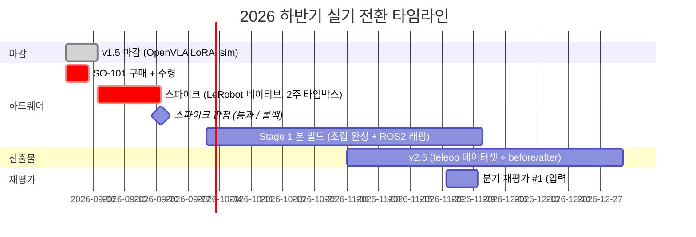

# 실기 전환 Implementation Plan — SO-101 조기 확보 → 스파이크 → Stage 1 → v2.5

> 작성일: 2026-08-30
> 대상: SO-101 구매 (§4) / 스파이크 (§5) / Stage 1 본 빌드 (§6) / v2.5 (§7) / 문서 수정 실행 보드 (§8) — README.md · Roadmap (Hardware-Arm, Phase 3·4·4.5·6·7) · Studies/Hardware-Arm/spike/ 신규
> 사유: **결정 (2026-08-30)** — SO-101 을 지금 구매하고, 9월 첫 2주를 LeRobot 네이티브 스택으로 팔을 돌리는 데만 쓴다. 스파이크를 통과하면 Stage 1 본 빌드와 v2.5 를 연내로 당긴다. 결정의 근거·대안 비교·되돌림 조건은 spec 에 있다
> Spec: [`docs/superpowers/specs/2026-08-30-realworld-transition-design.md`](../specs/2026-08-30-realworld-transition-design.md) / 근거 원본: [VLA 트렌드 취합 + 로드맵 방향 검토](../../research/2026-08-30-vla-trends-and-roadmap-review.md) (문서 갱신 지시 정의는 그 §7)
> 지위: **실기 전환 트랙의 절차·통과 기준·체크의 단일 원본.** 체크박스는 §4 (구매) · §5 (스파이크) · §6 (Stage 1) · §8 (문서 수정) · §10 (이번 주) 에서만 한다. [remediation plan](2026-07-07-repo-review-remediation.md) 실행 보드의 "10-11월 하드웨어 스파이크 (2-3주)" · "12월 Stage 1 착수" 행은 본 plan 으로 대체된다 (이관 표시는 §8 실행 보드 #13)
> 전제: v1.5 (OpenVLA LoRA, sim) 는 마지막 week 그대로 마감한다. 본 plan 은 v1.5 를 되돌리지 않는다

---

## 1. 왜 당기는가

| 근거 | 내용 |
|---|---|
| 리포가 인정한 약점 | Phase 4.5 §"다음 단계" 의 "sim 증거의 설득력 한계". 2026년 커뮤니티는 실기 결과 없는 sim-only 를 평가절하한다 |
| 모델 측 조건 | SmolVLA 는 LeRobot 커뮤니티 SO-100/101 데이터로 사전학습됨 → 실기 zero-shot 이 0% 에 붙지 않을 가능성이 높다. sim v1.6 없이 실기에서 before/after 가 성립한다 |
| 일정 측 조건 | 비용은 이미 2026.09 집행 예정. 리드타임 3일. 2026.09 부터 휴직 + PC 자택 → 물리 접근 최적 |
| 원칙 정합 | README 핵심 원칙 8 "가장 중요한 증거 = 가장 먼저 리스크 검증" |

결과: 2026.12 말에 "실기 zero-shot vs fine-tuned before/after (N회, 분산)" 를 확보하고, 2027.03 실지원에 sim 이 아닌 real 증거를 들고 간다. 리포가 Phase 7 (2027.08) 로 미뤄둔 "둘째 층 증거를 real 로 끌어올리기" 가 약 1년 당겨진다.

---

## 2. 변경 요약

| 항목 | 현재 리포 | 변경 |
|---|---|---|
| SO-101 구매 | 2026.09 | **즉시 (2026.08 말 ~ 09 초)** |
| 스파이크 | 2026.10, 2-3주, `feetech_ros2_driver` + ros2_control 검증 | **2026.09 초, 2주 타임박스, LeRobot 네이티브로 teleop + zero-shot 검증** |
| Stage 1 본 빌드 | 2026.12-2027.01 | 스파이크 통과 시 **2026.10-11** |
| v1.6 (sim, SmolVLA) | (검토 단계 제안) | **폐기** → 실기 v2.5 로 흡수 (spec §3) |
| v2.5 (teleop 데이터 + LeRobot 학습) | 2027.03~ | **2026.11-12** |
| ROS2 통합 | 스파이크 범위 | **Stage 1 본 빌드 항목으로 이동** |
| Phase 5 / Phase 6 / v2 / v3 | — | 변경 없음 (Phase 6 진입 시 Isaac Lab-Arena · LeRobot EnvHub 경로 체크 항목만 추가) |

---

## 3. 타임라인

> 롤백 시: 스파이크가 2주를 넘기면 원안 (10월 스파이크, 12월 본 빌드, 2027.03 v2.5) 으로 되돌린다. 즉흥 변경 금지 — 판정은 2026-09-21 한 번만 한다. 롤백해도 되돌리지 않는 것 (구매·v1.5 마감·문서 정합성 수정) 은 spec §6 참조.

---

## 4. 구매 체크리스트 (이번 주)

| 항목 | 내용 | 비고 |
|---|---|---|
| 팔 키트 | SO-101 리더 + 팔로워, Feetech STS3215, 3D 프린팅 부품 포함 | 국내 판매자, 리드타임 3일 |
| 전원 | 키트 동봉 여부 확인 (팔로워용 12V, 리더용 5V 또는 7.4V 규격은 키트 사양서 기준) | 누락 시 별도 구매 |
| USB-시리얼 보드 | 리더 · 팔로워 각 1개 (키트 동봉 여부 확인) | 포트 2개 필요 |
| 손목 카메라 | USB 카메라 1대 (1-3만원) | 스파이크는 기존 ELP 스테레오 1대로 시작해도 됨 |
| 작업대 자재 | 클램프, 테이블 고정, 작업 영역 매트 | 스파이크는 임시 고정으로 충분 |
| 예비 부품 | 서보 1개 여유 (선택) | 첫 조립 시 파손 대비 |

- [ ] 위 표 기준 주문 완료
- [ ] 구매 직후: 키트 사양서에서 **모터 ID 사전 할당 여부**와 **펌웨어 버전** 확인 (ID 미할당 키트는 조립 전에 모터별 ID 세팅이 선행된다)

---

## 5. 스파이크 (2026.09 첫 2주, 타임박스)

### 5.1 목표와 범위

- **목표**: "이 환경에서 SO-101 이 LeRobot 으로 teleop 되고, 데이터가 녹화되고, 사전학습 VLA 가 팔을 움직이는가" 만 확인한다.
- **범위 밖**: ROS2 드라이버, ros2_control, URDF, Isaac Sim, 파인튜닝, pick-and-place 성공률. 안 예뻐도 된다.
- **메인 트랙**: 이 2주의 메인 학습 트랙은 하드웨어 하나다. v1.5 블로그 마감 외 다른 학습 트랙은 열지 않는다.

### 5.2 통과 기준 (must)

| # | 기준 | 증거 |
|---|---|---|
| 1 | 리더-팔로워 teleop 동작 (6축 추종, 지연 체감 수준) | 30초 영상 |
| 2 | `lerobot-record` 로 단일 task 10 에피소드 녹화 + HF Hub (private) 업로드 | 데이터셋 repo id |
| 3 | `lerobot/smolvla_base` zero-shot 1회 실행 (팔이 명령에 반응해 움직임 — 성공 여부 무관) | 30초 영상 + 로그 |
| 4 | 추론 루프 latency 1회 측정 (4070, SmolVLA) | 수치 1줄 (OpenVLA 300ms 와 나란히 둘 비교 baseline) |

- [ ] must 1 — teleop (증거: 영상)
- [ ] must 2 — 10 에피소드 녹화 + Hub 업로드 (증거: repo id)
- [ ] must 3 — SmolVLA zero-shot 1회 실행 (증거: 영상 + 로그)
- [ ] must 4 — latency 측정 (증거: 수치 1줄)

nice: 부분 도달률 (reached / grasped) 기록 시도, 손목 카메라 추가.

### 5.3 주차별 진행

**Week 1 — 조립 · 캘리브레이션 · teleop**

| Day | 작업 | 막힐 때 |
|---|---|---|
| 1-2 | 팔로워 조립 (모터 ID 확인 → 링크 조립 → 배선) | 모터 ID 충돌 시 조립 전 ID 재할당 |
| 3 | 리더 조립 | 리더는 기어 제거 여부를 키트 사양서로 확인 |
| 4 | LeRobot 설치 (`pip install -e ".[feetech]"`), 포트 탐색 (`lerobot-find-port`), 캘리브레이션 (`lerobot-calibrate`) | 포트 권한 (`dialout` 그룹), USB 케이블 전원 부족 |
| 5 | teleop (`lerobot-teleoperate`) → 기준 1 확보 | 축 반전 · 오프셋은 캘리브레이션 재실행 |
| 6-7 | 버퍼 (조립 재작업 흡수) | — |

**Week 2 — 데이터 녹화 · zero-shot · latency**

| Day | 작업 | 막힐 때 |
|---|---|---|
| 8 | 카메라 세팅 (정면 1대, 손목 1대 선택) + `lerobot-record` 테스트 녹화 | 카메라 index, fps 안정성 |
| 9 | 단일 task 정의 (예: 큐브를 트레이로) → 10 에피소드 녹화 → Hub 업로드 → 기준 2 확보 | 에피소드 길이 · 시작 자세 통일 |
| 10 | SmolVLA zero-shot 실행 → 기준 3 확보 | action 스케일 · 카메라 키 이름 불일치 |
| 11 | latency 측정 스크립트 (Phase 4 측정 방법론 재사용, n=100) → 기준 4 확보 | — |
| 12-14 | 버퍼 + 스파이크 결과 기록 (`Studies/Hardware-Arm/spike/RESULT.md`) | — |

> 명령어 이름은 LeRobot 버전에 따라 바뀐다. 진입 시 https://huggingface.co/docs/lerobot 의 SO-101 페이지로 재확인한다.

### 5.4 판정 (2026-09-21)

| 결과 | 행동 |
|---|---|
| must 4개 통과 | Stage 1 본 빌드 2026.10 개시, v2.5 2026.11 개시 |
| 1-3 통과, 4 미완 | 통과로 간주 (latency 는 본 빌드 첫 주에 측정) |
| 1-2 통과, 3 실패 | 통과로 간주하되 v2.5 첫 항목을 "zero-shot 실행 디버깅" 으로 (도메인 갭 vs 통합 버그 구분은 v1.5 하네스 검증 논리 재사용) |
| 1 실패 (teleop 불가) 또는 2주 초과 | **롤백** — 원안 일정 복귀. 실패 원인 기록 후 분기 재평가 #1 입력 |

- [ ] **판정 기록 (2026-09-21, 1회만)**: `Studies/Hardware-Arm/spike/RESULT.md` 에 결과 행 명시 — (기입)

---

## 6. Stage 1 본 빌드 (2026.10-11, 통과 시)

스파이크에서 이미 팔이 돈다는 전제이므로 본 빌드의 초점은 **완성도 + ROS2 층**이다.

| 항목 | must / nice | 내용 |
|---|---|---|
| 조립 완성 | must | 케이블 정리, 작업대 고정, 손목 카메라 마운트 |
| 안전 기초 | must | 소프트 리밋 (관절 범위), 토크 상한, 물리 e-stop (전원 차단 스위치) |
| ROS2 래핑 | must | `feetech_ros2_driver` + ros2_control 로 joint state / command 노드 — **LeRobot 스택과 병행 운영**. LeRobot 은 데이터·학습, ROS2 는 배포·통합 층 |
| URDF | must | SO-101 공개 URDF 재사용 + 캘리브레이션 오프셋 반영 |
| Isaac Sim 임포트 | nice | Phase 6 로 이월 허용 |
| 1분 영상 | must | teleop + 정책 실행 + e-stop 시연 |

> ROS2 래핑 시 latency 를 두 경로로 측정한다: (a) LeRobot 직결, (b) ROS2 토픽 경유. (b)-(a) 가 "통합 오버헤드" 수치가 되고, 셋째 층 증거로 쓴다.

- [ ] 조립 완성 / - [ ] 안전 기초 / - [ ] ROS2 래핑 / - [ ] URDF / - [ ] 이중 latency 측정 ((a)·(b)) / - [ ] 1분 영상

---

## 7. v2.5 재정의 (2026.11-12)

기존 부록 B 의 v2.5 는 "teleop 데이터셋 + ACT 1회 학습" 이었다. 실기 VLA before/after 로 확장한다.

| 항목 | 내용 |
|---|---|
| 데이터 | SO-101 teleop, 단일 task, 50-100 에피소드 (실측 수집 속도로 재산정). LeRobot 포맷, HF Hub 공개 |
| 모델 | SmolVLA (로컬 4070 파인튜닝). GR00T N1.7 은 RunPod 여유 시 2번째 모델 옵션 |
| 측정 | zero-shot vs fine-tuned, 동일 조건 N회 (N ≥ 20), 성공률 + 부분 도달률 + 분산. v1.5 eval 논리를 real 로 이식 |
| 비교표 | OpenVLA int4 (sim, v1.5) / SmolVLA (real, v2.5) 의 latency·성공률 나란히 |
| ACT | nice — Diffusion Policy 와 함께 계보 노트로만 정리 (기존 방침 유지) |
| 산출 | 데이터셋 repo + 파인튜닝 체크포인트 + 비교표 + 블로그 1편 (v1.5 블로그의 real 후속편) |

성공 기준은 v1.5 와 동일: 성공률 상승이 아니라 **설계-실행-정량 분석**. negative 결과도 원인 분석으로 성립시킨다.

> 상세 주차 계획은 스파이크 판정 (§5.4) 통과 후 본 절에 갱신한다. 체크는 그때 추가.

---

## 8. 문서 수정 (실행 보드 — 별도 커밋, v1.5 마감 커밋과 분리)

> 항목 정의의 원본은 [검토 보고서 §7](../../research/2026-08-30-vla-trends-and-roadmap-review.md) — 아래 번호는 그 표의 # 와 일치한다. §8.1-§8.5 는 파일별 상세.

- [ ] #1-3 README 부록 D — 2026.11 행 "OpenVLA 후속 모델 등장 여부" 교체 / 시그널 매핑 구문 삭제 / 2027.05 행 "v3 모델 확정"
- [ ] #4 README 부록 B — v2.5 행 교체 (§7), v1.5 행 모델 명시, Jetson 행 SmolVLA 재검토
- [ ] #5 README 실측 결과 절 — "비교 baseline" 성격 + "재측정 + SmolVLA 비교 측정 2026.09 (스파이크 기준 4)"
- [ ] #6 README gantt·타임라인 요약·마일스톤 체크리스트 — 스파이크 09월 / Stage 1 10-11월 / v2.5 11-12월, Phase 4.5 완료 상태 반영
- [ ] #7 README 재평가 #1 입력 요약행 갱신
- [ ] #8 Hardware-Arm.md — 스파이크 절을 본 plan §5 로 교체, Stage 1 절에 §6 반영
- [ ] #9 Phase 4.5.md — 완료 기록 + 후속 v2.5 링크, "다음 단계" real 확장 주체 교체
- [ ] #10 Phase 7.md — Feetech 교정 (90·170행) + "OpenVLA fork" → "v2.5 확정 모델 fork"
- [ ] #11 Phase 6.md 97행 · Phase 3.md 153행 · Phase 4.md 208행 — Dynamixel 잔재 정리
- [ ] #12 신규 `Studies/Hardware-Arm/spike/RESULT.md` 골격 + 본 plan §5 체크리스트 복사
- [ ] #13 remediation plan 실행 보드 — 스파이크·Stage 1 행에 "본 plan 으로 대체" 이관 표시
- [ ] 검증: 리포 전체 grep — "OpenVLA 후속" 0건 / "Dynamixel" 은 Hardware-Arm.md 비채택 기록에만 잔존 → 커밋

### 8.1 `README.md`

| 위치 | 수정 |
|---|---|
| 실측 결과 표 | "재측정 2026-08 예정" → "재측정 + SmolVLA 비교 측정 2026.09 (스파이크 기준 4)" |
| 전체 로드맵 gantt | HW 스파이크 2026-10 → 2026-09 (2w). Stage 1 2026-12 → 2026-10 (2M). v2.5 마일스톤 2026-12 추가 |
| 타임라인 요약 표 | 2026.10 스파이크 행 → 2026.09. 2026.12-2027.01 Stage 1 행 → 2026.10-11. 2027.03 v2.5 착수 → 2026.11-12 |
| Phase 4.5 절 | 완료 상태 반영 + "후속: v2.5 (real, SmolVLA)" 한 줄 |
| Hardware-Arm 절 스파이크 | 범위를 "LeRobot 네이티브 teleop + 녹화 + zero-shot" 으로 교체. ROS2 드라이버 검증은 Stage 1 must 로 이동 |
| 마일스톤 체크리스트 | 2026.08-12 블록에 스파이크 must 4개 · Stage 1 · v2.5 항목 추가. 2027.03 블록의 v2.5 항목 삭제 |
| 부록 B | v2.5 행을 §7 정의로 교체. v1.5 행에 "모델: OpenVLA (선정 2026.06 기준)" 명시. Jetson 옵션 행에 "SmolVLA 기준 재검토" 추가 |
| 부록 D 2026.11 | "OpenVLA 후속 모델 등장 여부" 삭제 → "스파이크 판정 결과 / v2.5 진행률 / SmolVLA vs GR00T N1.7 2번째 모델 투입 여부" 로 교체. 시그널 매핑의 "OpenVLA 가 한 세대 뒤 → 2027.05 갱신" 삭제 |
| 부록 D 2027.05 | "VLA 모델 선정 재검토 (OpenVLA 유지 or …)" → "v3 모델 확정 (SmolVLA / GR00T N1.7 / 당시 최신)" |

### 8.2 `Roadmap/Hardware-Arm.md`

- 스파이크 절을 본 plan §5 로 교체 (목표 · must 4개 · 주차표 · 판정표).
- Stage 1 절에 §6 의 must/nice 표 반영. ROS2 래핑 + 이중 latency 측정 추가.
- 비채택 기록은 유지.

### 8.3 `Roadmap/Phase 7.md`

- Section 9.2 "Dynamixel 피드백" → "Feetech STS3215 피드백 (위치·부하·온도)".
- 참고자료 "Dynamixel SDK / `dynamixel_hardware`" → "Feetech SDK / `feetech_ros2_driver`".
- Section 9.1 의 "OpenVLA fork" → "v2.5 에서 확정한 모델 (SmolVLA 또는 GR00T N1.7) fork". 둘째 층 파이프라인 재사용 문단은 "v1.5 (sim) → v2.5 (real) 에서 이미 이식 완료, v3 는 확장" 으로 갱신.

### 8.4 `Roadmap/Phase 4.5.md`

- 상단에 완료 기록 + "후속 산출물: v2.5 (real, SmolVLA)" 링크.
- §"다음 단계" 의 "Phase 7 에서 real 확장" → "v2.5 (2026.11-12) 에서 real 확장, Phase 7 은 안전 인터록 · 디지털 트윈 결합".

### 8.5 신규 파일

- `Studies/Hardware-Arm/spike/RESULT.md` — 스파이크 결과 (must 4개 증거 링크, 소요 시간, 막힌 지점, 판정).

---

## 9. 리스크

| 리스크 | 대응 |
|---|---|
| 첫 하드웨어는 계획의 2-3배 | 2주 타임박스 + 롤백 조건 명문화 (§5.4). 판정은 한 번만 |
| 휴직 중 주 6-8시간 예산 초과 | 9-11월 메인 트랙 = 하드웨어 1개. Phase 5 · 동역학 · C++/DDS 트랙은 열지 않음 (2026.11 재평가 안건 그대로 유지) |
| LeRobot 스택과 ROS2 스택 이중화 | 역할 분리 명시 (데이터·학습 = LeRobot, 배포·통합 = ROS2). 통합 오버헤드 측정이 오히려 셋째 층 증거 |
| SmolVLA zero-shot 이 실기에서 0% | v1.5 하네스 검증 논리 재사용 (도메인 갭 vs 통합 버그 구분). 부분 도달률로 신호 확보 |
| Isaac Sim 디지털 트윈 (v2) 지연 | 팔이 먼저 돌아야 트윈의 분모가 생기므로 순서 정상화. Phase 6 일정은 변경 없음 |
| 모델 세대 교체 재발 | v2.5 하네스를 모델 무관하게 설계 (LeRobot policy 인터페이스). 2번째 모델 투입 비용을 1-2주로 고정 |

---

## 10. 이번 주 할 일

- [ ] SO-101 키트 + 손목 카메라 + 작업대 자재 주문 (§4)
- [ ] 키트 사양서로 모터 ID · 전원 · USB 보드 동봉 여부 확인
- [ ] v1.5 블로그에 "선정 시점 vs 마감 시점의 필드 변화" 한 단락 추가 후 마감 (검토 보고서 §3.2)
- [ ] `Studies/Hardware-Arm/spike/` 디렉토리 생성 + 본 plan §5 체크리스트 복사
- [ ] 문서 수정 실행 보드 (§8) 진행 — v1.5 마감 커밋과 분리해 별도 커밋
