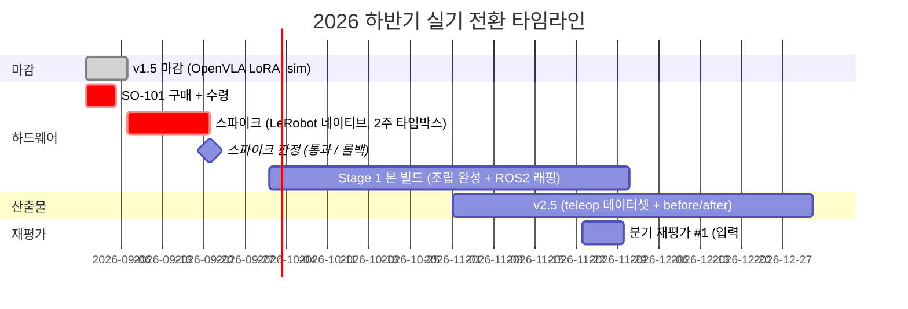

# 실기 전환 Implementation Plan — SO-101 조기 확보 → 스파이크 → Stage 1 → v2.5

> 작성일: 2026-08-30
> 대상: SO-101 구매 (§4) / 스파이크 (§5) / Stage 1 본 빌드 (§6) / v2.5 (§7) / 문서 수정 실행 보드 (§8) / 전체 todo 마스터 보드 (§10) — README.md · Roadmap (Hardware-Arm, Phase 3·4·4.5·6·7) · Studies/Hardware-Arm/spike/ 신규 · remediation plan 이관 표시 · **발행 채널 변경 (블로그 → `vla-lab` repo)**
> 사유: **결정 (2026-08-30)** — SO-101 을 지금 구매하고, 9월 첫 2주를 LeRobot 네이티브 스택으로 팔을 돌리는 데만 쓴다. 스파이크를 통과하면 Stage 1 본 빌드와 v2.5 를 연내로 당긴다. 서사 산출물의 발행 채널은 velog 블로그가 아니라 **본인 GitHub `vla-lab` repo** (기존 보유, 현재 빈 상태 — career spec 이 정의한 "별도 공개 산출물 repo" 의 실체) 로 확정한다. 결정의 근거·대안 비교·되돌림 조건은 spec 에 있다
> Spec: [`docs/superpowers/specs/2026-08-30-realworld-transition-design.md`](../specs/2026-08-30-realworld-transition-design.md) / 근거 원본: [VLA 트렌드 취합 + 로드맵 방향 검토](../../research/2026-08-30-vla-trends-and-roadmap-review.md)
> 지위: **실기 전환 트랙의 절차·통과 기준·체크의 단일 원본.** spec 결정을 원본 문서에 반영하는 데 필요한 **모든 수정 내용이 §8 에 "현재 → 변경" 전문으로**, 이 문서로 인한 **모든 실행 항목이 §10 마스터 보드에** checkbox 로 있다. [remediation plan](2026-07-07-repo-review-remediation.md) 실행 보드의 "10-11월 하드웨어 스파이크 (2-3주)" · "12월 Stage 1 착수" 행은 본 plan 으로 대체된다 (이관 표시: §8.6 #57)
> 전제: v1.5 (OpenVLA LoRA, sim) 는 마지막 week 그대로 마감한다. 본 plan 은 v1.5 를 되돌리지 않는다

---

## 1. 왜 당기는가

| 근거 | 내용 |
|---|---|
| 리포가 인정한 약점 | Phase 4.5 §"다음 단계" 의 "sim 증거의 설득력 한계". 2026년 커뮤니티는 실기 결과 없는 sim-only 를 평가절하한다 |
| 모델 측 조건 | SmolVLA 는 LeRobot 커뮤니티 SO-100/101 데이터로 사전학습됨 → 실기 zero-shot 이 0% 에 붙지 않을 가능성이 높다. sim v1.6 없이 실기에서 before/after 가 성립한다 |
| 일정 측 조건 | 비용은 이미 2026.09 집행 예정. 리드타임 3일. 2026.09 부터 휴직 + PC 자택 → 물리 접근 최적 |
| 원칙 정합 | README 핵심 원칙 8 "가장 중요한 증거 = 가장 먼저 리스크 검증" |

결과: 2026.12 말에 "실기 zero-shot vs fine-tuned before/after (N회, 분산)" 를 확보하고, 2027.03 실지원에 sim 이 아닌 real 증거를 들고 간다. 리포가 Phase 7 (2027.08) 로 미뤄둔 "둘째 층 증거를 real 로 끌어올리기" 가 약 1년 당겨진다.

---

## 2. 변경 요약

| 항목 | 현재 리포 | 변경 |
|---|---|---|
| SO-101 구매 | 2026.09 | **즉시 (2026.08 말 ~ 09 초)** |
| 스파이크 | 2026.10, 2-3주, `feetech_ros2_driver` + ros2_control 검증 | **2026.09 초, 2주 타임박스, LeRobot 네이티브로 teleop + zero-shot 검증** |
| Stage 1 본 빌드 | 2026.12-2027.01 | 스파이크 통과 시 **2026.10-11** |
| v1.6 (sim, SmolVLA) | (검토 단계 제안) | **폐기** → 실기 v2.5 로 흡수 (spec §3) |
| v2.5 (teleop 데이터 + LeRobot 학습) | 2027.03~ | **2026.11-12** |
| ROS2 통합 | 스파이크 범위 | **Stage 1 본 빌드 항목으로 이동** |
| 발행 채널 | velog 블로그 1편 + LinkedIn | **`vla-lab` repo 공개 문서 (마크다운 + 동반 코드)** — LinkedIn 은 링크 공유 채널로 유지 |
| Phase 5 / Phase 6 / v2 / v3 | — | 변경 없음 (Phase 6 진입 시 Isaac Lab-Arena · LeRobot EnvHub 경로 체크 항목만 추가) |

---

## 3. 타임라인

> 롤백 시: 스파이크가 2주를 넘기면 원안 (10월 스파이크, 12월 본 빌드, 2027.03 v2.5) 으로 되돌린다. 즉흥 변경 금지 — 판정은 2026-09-21 한 번만 한다. 롤백해도 되돌리지 않는 것 (구매·v1.5 마감·문서 정합성 수정·vla-lab 채널 변경) 은 spec §6 참조.

---

## 4. 구매 체크리스트 (이번 주)

| 항목 | 내용 | 비고 |
|---|---|---|
| 팔 키트 | SO-101 리더 + 팔로워, Feetech STS3215, 3D 프린팅 부품 포함 | 국내 판매자, 리드타임 3일 |
| 전원 | 키트 동봉 여부 확인 (팔로워용 12V, 리더용 5V 또는 7.4V 규격은 키트 사양서 기준) | 누락 시 별도 구매 |
| USB-시리얼 보드 | 리더 · 팔로워 각 1개 (키트 동봉 여부 확인) | 포트 2개 필요 |
| 손목 카메라 | USB 카메라 1대 (1-3만원) | 스파이크는 기존 ELP 스테레오 1대로 시작해도 됨 |
| 작업대 자재 | 클램프, 테이블 고정, 작업 영역 매트 | 스파이크는 임시 고정으로 충분 |
| 예비 부품 | 서보 1개 여유 (선택) | 첫 조립 시 파손 대비 |

- [ ] 위 표 기준 주문 완료
- [ ] 구매 직후: 키트 사양서에서 **모터 ID 사전 할당 여부**와 **펌웨어 버전** 확인 (ID 미할당 키트는 조립 전에 모터별 ID 세팅이 선행된다)

---

## 5. 스파이크 (2026.09 첫 2주, 타임박스)

### 5.1 목표와 범위

- **목표**: "이 환경에서 SO-101 이 LeRobot 으로 teleop 되고, 데이터가 녹화되고, 사전학습 VLA 가 팔을 움직이는가" 만 확인한다.
- **범위 밖**: ROS2 드라이버, ros2_control, URDF, Isaac Sim, 파인튜닝, pick-and-place 성공률. 안 예뻐도 된다.
- **메인 트랙**: 이 2주의 메인 학습 트랙은 하드웨어 하나다. v1.5 마감 문서 (vla-lab) 외 다른 학습 트랙은 열지 않는다.

### 5.2 통과 기준 (must)

| # | 기준 | 증거 |
|---|---|---|
| 1 | 리더-팔로워 teleop 동작 (6축 추종, 지연 체감 수준) | 30초 영상 |
| 2 | `lerobot-record` 로 단일 task 10 에피소드 녹화 + HF Hub (private) 업로드 | 데이터셋 repo id |
| 3 | `lerobot/smolvla_base` zero-shot 1회 실행 (팔이 명령에 반응해 움직임 — 성공 여부 무관) | 30초 영상 + 로그 |
| 4 | 추론 루프 latency 1회 측정 (4070, SmolVLA) | 수치 1줄 (OpenVLA 300ms 와 나란히 둘 비교 baseline) |

- [ ] must 1 — teleop (증거: 영상)
- [ ] must 2 — 10 에피소드 녹화 + Hub 업로드 (증거: repo id)
- [ ] must 3 — SmolVLA zero-shot 1회 실행 (증거: 영상 + 로그)
- [ ] must 4 — latency 측정 (증거: 수치 1줄)

nice: 부분 도달률 (reached / grasped) 기록 시도, 손목 카메라 추가.

### 5.3 주차별 진행

**Week 1 — 조립 · 캘리브레이션 · teleop**

| Day | 작업 | 막힐 때 |
|---|---|---|
| 1-2 | 팔로워 조립 (모터 ID 확인 → 링크 조립 → 배선) | 모터 ID 충돌 시 조립 전 ID 재할당 |
| 3 | 리더 조립 | 리더는 기어 제거 여부를 키트 사양서로 확인 |
| 4 | LeRobot 설치 (`pip install -e ".[feetech]"`), 포트 탐색 (`lerobot-find-port`), 캘리브레이션 (`lerobot-calibrate`) | 포트 권한 (`dialout` 그룹), USB 케이블 전원 부족 |
| 5 | teleop (`lerobot-teleoperate`) → 기준 1 확보 | 축 반전 · 오프셋은 캘리브레이션 재실행 |
| 6-7 | 버퍼 (조립 재작업 흡수) | — |

**Week 2 — 데이터 녹화 · zero-shot · latency**

| Day | 작업 | 막힐 때 |
|---|---|---|
| 8 | 카메라 세팅 (정면 1대, 손목 1대 선택) + `lerobot-record` 테스트 녹화 | 카메라 index, fps 안정성 |
| 9 | 단일 task 정의 (예: 큐브를 트레이로) → 10 에피소드 녹화 → Hub 업로드 → 기준 2 확보 | 에피소드 길이 · 시작 자세 통일 |
| 10 | SmolVLA zero-shot 실행 → 기준 3 확보 | action 스케일 · 카메라 키 이름 불일치 |
| 11 | latency 측정 스크립트 (Phase 4 측정 방법론 재사용, n=100) → 기준 4 확보 | — |
| 12-14 | 버퍼 + 스파이크 결과 기록 (`Studies/Hardware-Arm/spike/RESULT.md`) | — |

> 명령어 이름은 LeRobot 버전에 따라 바뀐다. 진입 시 https://huggingface.co/docs/lerobot 의 SO-101 페이지로 재확인한다.

### 5.4 판정 (2026-09-21)

| 결과 | 행동 |
|---|---|
| must 4개 통과 | Stage 1 본 빌드 2026.10 개시, v2.5 2026.11 개시 |
| 1-3 통과, 4 미완 | 통과로 간주 (latency 는 본 빌드 첫 주에 측정) |
| 1-2 통과, 3 실패 | 통과로 간주하되 v2.5 첫 항목을 "zero-shot 실행 디버깅" 으로 (도메인 갭 vs 통합 버그 구분은 v1.5 하네스 검증 논리 재사용) |
| 1 실패 (teleop 불가) 또는 2주 초과 | **롤백** — 원안 일정 복귀. 실패 원인 기록 후 분기 재평가 #1 입력 |

- [ ] **판정 기록 (2026-09-21, 1회만)**: `Studies/Hardware-Arm/spike/RESULT.md` 에 결과 행 명시 — (기입)

---

## 6. Stage 1 본 빌드 (2026.10-11, 통과 시)

스파이크에서 이미 팔이 돈다는 전제이므로 본 빌드의 초점은 **완성도 + ROS2 층**이다.

| 항목 | must / nice | 내용 |
|---|---|---|
| 조립 완성 | must | 케이블 정리, 작업대 고정, 손목 카메라 마운트 |
| 안전 기초 | must | 소프트 리밋 (관절 범위), 토크 상한, 물리 e-stop (전원 차단 스위치) |
| ROS2 래핑 | must | `feetech_ros2_driver` + ros2_control 로 joint state / command 노드 — **LeRobot 스택과 병행 운영**. LeRobot 은 데이터·학습, ROS2 는 배포·통합 층 |
| URDF | must | SO-101 공개 URDF 재사용 + 캘리브레이션 오프셋 반영 |
| Isaac Sim 임포트 | nice | Phase 6 로 이월 허용 |
| 1분 영상 | must | teleop + 정책 실행 + e-stop 시연 |

> ROS2 래핑 시 latency 를 두 경로로 측정한다: (a) LeRobot 직결, (b) ROS2 토픽 경유. (b)-(a) 가 "통합 오버헤드" 수치가 되고, 셋째 층 증거로 쓴다.

- [ ] 조립 완성 (must)
- [ ] 안전 기초 — 소프트 리밋 + 토크 상한 + 물리 e-stop (must)
- [ ] ROS2 래핑 — `feetech_ros2_driver` + ros2_control 노드 (must)
- [ ] URDF — 공개 URDF 재사용 + 오프셋 반영 (must)
- [ ] 이중 latency 측정 — (a) LeRobot 직결 / (b) ROS2 경유 / (b)-(a) 통합 오버헤드 (must)
- [ ] 1분 영상 — teleop + 정책 실행 + e-stop (must)
- [ ] Isaac Sim 임포트 (nice — Phase 6 이월 허용)

---

## 7. v2.5 재정의 (2026.11-12)

기존 부록 B 의 v2.5 는 "teleop 데이터셋 + ACT 1회 학습" 이었다. 실기 VLA before/after 로 확장한다.

| 항목 | 내용 |
|---|---|
| 데이터 | SO-101 teleop, 단일 task, 50-100 에피소드 (실측 수집 속도로 재산정). LeRobot 포맷, HF Hub 공개 |
| 모델 | SmolVLA (로컬 4070 파인튜닝). GR00T N1.7 은 RunPod 여유 시 2번째 모델 옵션 |
| 측정 | zero-shot vs fine-tuned, 동일 조건 N회 (N ≥ 20), 성공률 + 부분 도달률 + 분산. v1.5 eval 논리를 real 로 이식 |
| 비교표 | OpenVLA int4 (sim, v1.5) / SmolVLA (real, v2.5) 의 latency·성공률 나란히 |
| ACT | nice — Diffusion Policy 와 함께 계보 노트로만 정리 (기존 방침 유지) |
| 산출 | 데이터셋 repo + 파인튜닝 체크포인트 + 비교표 + **vla-lab 공개 문서 1편** (v1.5 마감 문서의 real 후속편, 동반 코드 포함) |

성공 기준은 v1.5 와 동일: 성공률 상승이 아니라 **설계-실행-정량 분석**. negative 결과도 원인 분석으로 성립시킨다.

- [ ] teleop 데이터셋 수집 (단일 task, 50-100 에피소드) + LeRobot 포맷 + HF Hub 공개
- [ ] SmolVLA zero-shot 측정 (N ≥ 20, 성공률 + 부분 도달률 + 분산)
- [ ] SmolVLA 파인튜닝 (로컬 4070) + fine-tuned 측정 (동일 조건 N회)
- [ ] before/after 비교표 + OpenVLA (sim, v1.5) 병기
- [ ] vla-lab 공개 문서 1편 (real 후속편, 동반 코드 포함)
- [ ] (nice) GR00T N1.7 2번째 모델 투입 / ACT-Diffusion 계보 노트

> 상세 주차 계획은 스파이크 판정 (§5.4) 통과 후 본 절에 갱신한다.

---

## 8. 문서 수정 실행 보드 (별도 커밋 — v1.5 마감 커밋과 분리)

> **spec 의 결정 (§2-§5) 과 발행 채널 변경 (블로그 → vla-lab) 을 원본 문서에 반영하는 전체 작업 목록.** 각 항목이 "현재 → 변경" 전문 인용으로 자기완결이라, 이 절만 보고 수정할 수 있고 누락 여부를 검증할 수 있다. 행 번호는 2026-08-30 기준 — 실행 시 "현재" 문구로 재탐색한다.

### 8.1 `README.md`

**A. 실측 결과 절 (9-21행) — 비교 baseline 재정의**

- [x] 1. 표 리드 (11행)
  - 현재: `> 이 리포의 가장 강한 증거를 먼저 둔다. 상세 데이터·방법론·판단 근거: [...]`
  - 변경: 문장 뒤에 추가 — `이 표는 AR 토큰 방식 VLA 의 **비교 baseline** 이다: action-chunk 계열 (SmolVLA) 과의 동일 하드웨어 비교는 스파이크 must 4 와 v2.5 비교표에서 이 수치를 분모로 쓴다.`
- [x] 2. 측정 줄 (20행)
  - 현재: `측정: 2026-06, 재측정 (방법론 보강 + p50/p99/VRAM peak) 2026-08 예정. Rerun 시각화 gif 는 확보 시 이 절에 추가.`
  - 변경: `측정: 2026-06. 재측정 (방법론 보강 + p50/p99/VRAM peak) 은 **SmolVLA 비교 측정과 통합해 2026.09 수행** (실기 전환 plan §5.2 must 4). Rerun 시각화 gif 는 확보 시 이 절에 추가.`

**B. 전체 로드맵 gantt (63-99행)**

- [x] 3. 75행
  - 현재: `HW 스파이크 (SO-101 드라이버 선검증) :crit, h0, 2026-10, 3w`
  - 변경: `HW 스파이크 (LeRobot 네이티브 실기 검증) :crit, h0, 2026-09, 2w`
- [x] 4. 76행
  - 현재: `Stage 1 (SO-101 본 빌드, v2 선행) :h1, 2026-12, 2M`
  - 변경: `Stage 1 (SO-101 본 빌드 + ROS2 래핑, v2 선행) :h1, 2026-10, 2M`
- [x] 5. 산출물 section (`v1.5 공개` 마일스톤 행 다음) 에 추가:
  - `v2.5 공개 (teleop 데이터셋 + SmolVLA 실기 before-after) :milestone, d25, 2026-12, 0d`

**C. 타임라인 요약 표 (108-125행)**

- [x] 6. 114행 Phase 4.5 행 — 기간 셀 `2026.08 (Section 0) + 2026.09-11 (Sections 1-3)` 뒤에 `(실측 선행 — 마감 2026.09 초)` 추가
- [x] 7. 117행
  - 현재: `| 2026.10 | Stage 1 | **하드웨어 스파이크 (2-3주)**: SO-101 모터 1-2개 + \`feetech_ros2_driver\` + ros2_control 파이프라인이 도는지만 검증 (조립 전 선검증) | 리스크 조기 검증 (분기 재평가 #1 입력) |`
  - 변경: `| 2026.09 | Stage 1 | **하드웨어 스파이크 (2주 타임박스)**: SO-101 조립 + LeRobot 네이티브 (teleop + 10 에피소드 녹화 + SmolVLA zero-shot + latency). 판정 2026-09-21 1회 (실기 전환 plan §5) | 리스크 조기 검증 (분기 재평가 #1 입력) |`
- [x] 8. 119행 재평가 #1 행
  - 현재: `… (정찰 지원 없이 수행 — 입력: 스파이크 결과 / v1 결과 / 시장 신호 probe 반응 / 모델 갱신) …`
  - 변경: `… (정찰 지원 없이 수행 — 입력: 스파이크 판정 결과 / v1·v1.5 결과 / v2.5 진행률 / 시장 신호 probe 반응) …`
- [x] 9. 120행
  - 현재: `| 2026.12-2027.01 | Stage 1 | **Hardware-Arm Stage 1 (SO-101 본 빌드, 스파이크로 디리스크)** + URDF + Sim 디지털 트윈 (v2 선행). 2027.02 는 지연 흡수 버퍼 | v2 하드웨어 기반 |`
  - 변경: `| 2026.10-11 | Stage 1 | **Hardware-Arm Stage 1 (본 빌드 + ROS2 래핑 + 이중 latency 측정)** + URDF (v2 선행). Isaac Sim 임포트는 nice — Phase 6 이월 허용. 12월-2027.02 는 v2.5 마무리 + 지연 흡수 버퍼 | v2 하드웨어 기반 |`
- [x] 10. 120행 다음에 새 행 추가:
  - `| 2026.11-12 | Stage 1 | **v2.5: SO-101 teleop 데이터셋 (LeRobot 포맷, HF Hub 공개) + SmolVLA 실기 zero-shot vs fine-tuned (N≥20, 분산·부분 도달률) + vla-lab 공개 문서** | **산출물 v2.5 (real 둘째 층 증거)** |`

**D. 실습 가이드 표 (178-179행)**

- [x] 11. 178행
  - 현재: `| Hardware-Arm 스파이크 | 미리 작성됨 — 진입 시 (2026.10) 다시 체크 | ROS2 (SO-101 드라이버 선검증) |`
  - 변경: `| Hardware-Arm 스파이크 | 미리 작성됨 — 진입 시 (2026.09) 다시 체크 (범위가 LeRobot 네이티브로 변경됨 — 실기 전환 plan §5 기준으로 재검토) | LeRobot (teleop·녹화·zero-shot·latency) |`
- [x] 12. 179행
  - 현재: `| Hardware-Arm Stage 1 | 미리 작성됨 — 진입 시 (2026.12) 다시 체크 | ROS2 + URDF |`
  - 변경: `| Hardware-Arm Stage 1 | 미리 작성됨 — 진입 시 (2026.10) 다시 체크 | ROS2 + URDF |`

**E. Hardware-Arm 절 (292-330행)**

- [x] 13. 292행 헤더
  - 현재: `### Hardware-Arm: 자작 팔 트랙 (스파이크 + 2단계, 2026.10-2027.06)`
  - 변경: `### Hardware-Arm: 자작 팔 트랙 (스파이크 + 2단계, 2026.09-2027.06)`
- [x] 14. 302-305행 스파이크 블록 전문 교체
  - 현재:
    - `#### 스파이크 (2026.10, 2-3주, 산출물 아님 = 리스크 검증)`
    - `- **범위**: 키트 전체 조립 전에 모터 1-2개만 버스에 물려 전기·소프트웨어 경로만 확인. 안 예뻐도 됨.`
    - `- **목표**: "Feetech 버스 + \`feetech_ros2_driver\` + ros2_control 이 내 환경에서 도는가" 만 확인. pick-and-place 아님.`
    - `- **출력**: 예상보다 오래 걸리면 Stage 1 의 ROS2 통합 경로·일정을 **2026 년 안에** 재산정. 결과는 분기 재평가 #1 (2026.11) 입력.`
  - 변경:
    - `#### 스파이크 (2026.09, 2주 타임박스, 산출물 아님 = 리스크 검증)`
    - `- **범위**: 조립 + LeRobot 네이티브 스택 검증. ROS2/URDF/Isaac Sim/파인튜닝은 범위 밖 (ROS2 는 Stage 1 로 이동). 안 예뻐도 됨.`
    - `- **목표**: must 4 — teleop / \`lerobot-record\` 10 에피소드 + HF Hub / SmolVLA zero-shot 1회 실행 / latency 측정 (실기 전환 plan §5.2).`
    - `- **출력**: **판정 2026-09-21 1회** — 통과 시 Stage 1 2026.10 개시, teleop 불가 또는 2주 초과 시 원안 일정 (10월 스파이크·12월 빌드) 롤백. 결과는 분기 재평가 #1 (2026.11) 입력.`
- [x] 15. 308-313행 Stage 1 블록
  - 현재 헤더: `#### Stage 1 (2026.12-2027.01, 2개월, 추가 지출 없음) — 스파이크로 디리스크된 본 빌드 (v2 선행)`
  - 변경 헤더: `#### Stage 1 (2026.10-11, 2개월, 추가 지출 없음) — 스파이크로 디리스크된 본 빌드 (v2 선행)`
  - 현재 목표: `- **목표**: pick-and-place 단순 동작 + URDF + ROS2 드라이버 (\`feetech_ros2_driver\`) + Isaac Sim 디지털 트윈 첫 사이클`
  - 변경 목표: `- **목표**: pick-and-place 단순 동작 + 안전 기초 (소프트 리밋·토크 상한·물리 e-stop) + URDF + **ROS2 래핑 (\`feetech_ros2_driver\` + ros2_control, LeRobot 스택과 병행 운영 — 이중 latency 로 통합 오버헤드 측정)**. Isaac Sim 임포트는 nice (Phase 6 이월 허용)`
  - 현재 이유: `- **이유**: 스파이크에서 드라이버 경로를 이미 검증했으므로 본 빌드는 조립과 동작 완성도에 집중.`
  - 변경 이유: `- **이유**: 스파이크에서 LeRobot 경로 (teleop·녹화·정책 실행) 를 이미 검증했으므로 본 빌드는 완성도 + ROS2 층에 집중.`
  - 현재 비용: `- **비용**: 팔 키트·손목 카메라·작업대 자재가 2026.09 에 선집행되므로 이 구간의 추가 지출은 없다.`
  - 변경 비용: `- **비용**: 팔 키트·손목 카메라·작업대 자재가 2026.08 말-09 초에 선집행되므로 이 구간의 추가 지출은 없다.`
- [x] 16. 328행 조달 행
  - 현재: `| 조달 | 국내 판매자, 3D 프린팅 부품 포함, 리드타임 3일 → **2026.09 단일 구매** (팔 키트 + 손목 카메라 + 작업대 자재 일괄). 스파이크는 2026.10 |`
  - 변경: `| 조달 | 국내 판매자, 3D 프린팅 부품 포함, 리드타임 3일 → **2026.08 말-09 초 즉시 단일 구매** (팔 키트 + 손목 카메라 + 작업대 자재 일괄). 스파이크는 2026.09 첫 2주 |`

**F. 텍스트 로드맵 (460-476행)**

- [x] 17. 466행
  - 현재: `HW 스파이크 (2026.10): SO-101 드라이버 선검증 (산출물 아님)`
  - 변경: `HW 스파이크 (2026.09): SO-101 LeRobot 네이티브 실기 검증 (산출물 아님)`
- [x] 18. 469행
  - 현재: `분기 재평가 #1 (2026.11): 스파이크 결과 + v1 결과 + 시장 신호 probe 반응 (정찰 지원 없이 수행)`
  - 변경: `분기 재평가 #1 (2026.11): 스파이크 판정 + v1·v1.5 결과 + v2.5 진행률 + 시장 신호 probe 반응 (정찰 지원 없이 수행)`
- [x] 19. 472행 + 새 노드
  - 현재: `Hardware-Arm Stage 1 (2026.12-2027.01): v2 선행 하드웨어 (자작 팔 본 빌드)`
  - 변경: `Hardware-Arm Stage 1 (2026.10-11): v2 선행 하드웨어 (본 빌드 + ROS2 래핑)` — 그리고 재평가 #1 노드와 Stage 1 노드 순서를 조정하거나, Stage 1 다음에 `v2.5 (2026.11-12): teleop 데이터셋 + SmolVLA 실기 before/after (vla-lab 공개)` 노드 추가 (화살표 흐름 유지)

**G. 마일스톤 체크리스트 (525-560행)**

- [x] 20. "#### 2026.08-12" 블록 스파이크 행
  - 현재: `- [ ] SO-101 모터 1-2개 + \`feetech_ros2_driver\` + ros2_control 로 각도 명령 1회 성공 (조립 전 선검증)`
  - 변경: `- [ ] 스파이크 must 4 (teleop / 10 에피소드 녹화+Hub / SmolVLA zero-shot / latency) + 판정 2026-09-21 (실기 전환 plan §5)`
- [x] 21. 같은 블록 재산정 행
  - 현재: `- [ ] 스파이크 결과로 Stage 1 ROS2 통합 경로·일정 재산정 (터지면 즉시)`
  - 변경 (2행으로 교체):
    - `- [ ] Hardware-Arm Stage 1 must 완성 (2026.10-11 — 조립 + 안전 기초 + ROS2 래핑 + URDF + 이중 latency + 1분 영상)`
    - `- [ ] v2.5 완성 (2026.11-12 — teleop 데이터셋 HF Hub 공개 + SmolVLA before/after N≥20 + vla-lab 공개 문서)`
- [x] 22. 541행 재평가 #1 행
  - 현재: `- [ ] **6개월 분기 재평가 #1 (2026.11)** — 정찰 지원 없이 수행. 입력: 스파이크 결과 / v1 결과(레포) / 시장 신호 (probe 반응, 1순위 채용 활성도, OpenVLA 후속 모델 등장 여부)`
  - 변경: `- [ ] **6개월 분기 재평가 #1 (2026.11)** — 정찰 지원 없이 수행. 입력: 스파이크 판정 결과 / v1·v1.5 결과(레포) / v2.5 진행률 / 시장 신호 (probe 반응, 1순위 채용 활성도)`
- [x] 23. "#### 2026.12-2027.02" 블록
  - 현재: `- [ ] Hardware-Arm Stage 1 must 완성 (SO-101 조립 + URDF + ROS2 드라이버 + pick-and-place + 1분 영상) — v2 선행. Isaac Sim 임포트·ACT 1회는 nice (이월 허용 — Hardware-Arm.md 체크리스트 must/nice 분해)`
  - 변경: 행 삭제 (#21 로 2026.08-12 블록에 이동됨). 블록 제목은 `#### 2026.12-2027.02 (v2.5 마무리 + 초기 패키징, 복직 직전)` 으로 교체. 초기 패키징·이력서·계보 노트 행은 유지
- [x] 24. "#### 2027.03~" 블록 v2.5 행
  - 현재: `- [ ] (v2.5 착수) SO-101 teleop 데이터셋 수집 개시 + LeRobot ACT 1회 학습 (부록 B v2.5, 실지원 병행)`
  - 변경: 행 삭제 (v2.5 는 2026.11-12 완료로 이동 — #21)
- [x] 25. 같은 블록 재평가 #2 행
  - 현재: `- [ ] **6개월 분기 재평가 #2 (2027.05)** — Phase 5 결과 / Stage 2 완성도 / VLA 모델 갱신 (OpenVLA 유지 or π0/Helix 등)`
  - 변경: `- [ ] **6개월 분기 재평가 #2 (2027.05)** — Phase 5 결과 / Stage 2 완성도 / v3 모델 확정 (SmolVLA / GR00T N1.7 / 당시 최신)`

**H. 부록 A (Phase ↔ 디렉토리 매핑, 598-612행)**

- [x] 26. Hardware-Arm 행 — 기간 `2026.10-2027.06` → `2026.09-2027.06`

**I. 부록 B (산출물 정의, 617-632행)**

- [x] 27. 리드 문단 (620행)
  - 현재: `… 외부 공개 산출물·블로그 동반 코드는 **별도 공개 산출물 repo** 에서 발행한다 — 이 레포는 비공개 유지 (2026-07-20 결정).`
  - 변경: `… 외부 공개 산출물·서사 문서·동반 코드는 **공개 산출물 repo \`vla-lab\`** (본인 GitHub) 에서 발행한다 — 서사 발행 채널을 velog 블로그에서 vla-lab 마크다운 문서로 변경 (2026-08-30). LinkedIn 은 링크 공유 채널. 이 레포는 비공개 유지 (2026-07-20 결정).`
- [x] 28. v1.5 행 (625행)
  - 현재: `| **v1.5 (둘째 층 증거)** | 2026 하반기 (Section 0 은 2026.08 전진 — Sections 1-3 선행) | OpenVLA LoRA adaptation (sim 데이터) + zero-shot 대비 **before/after 성공률 정량 분석** (N회, 분산 포함) + 블로그 1편 (= Phase 4.5). 성공률 상승이 아닌 **설계-실행-분석** 이 기준 | **2 (둘째 층 adaptation 가점 카드)** |`
  - 변경: `| **v1.5 (둘째 층 증거)** | 2026 하반기 (마감 2026.09 초 — 실측 선행) | **모델: OpenVLA (선정 2026.06 기준 — 세대 교체 반영은 v2.5 의 SmolVLA)**. OpenVLA LoRA adaptation (sim 데이터) + zero-shot 대비 **before/after 성공률 정량 분석** (N회, 분산 포함) + vla-lab 공개 문서 1편 (= Phase 4.5). 성공률 상승이 아닌 **설계-실행-분석** 이 기준 | **2 (둘째 층 adaptation 가점 카드)** |`
- [x] 29. v2.5 행 (626행)
  - 현재: `| **v2.5 (데이터 파이프라인 증거)** | 2027 상반기 (Stage 1 조립 후) | SO-101 리더-팔로워 teleop 으로 자작 데이터셋 수집 (100-500 episodes 는 실측 수집 속도 기준 재산정) → **LeRobot 포맷 + HF Hub 공개** + LeRobot ACT 1회 학습·결과 기록. Diffusion Policy 는 학습하지 않고 라잇 정리 (ACT-Diffusion-VLA 계보, 면접 방어용) | 2 (데이터 레짐·정책 계보 증거) |`
  - 변경: `| **v2.5 (real 둘째 층 증거)** | **2026.11-12** (Stage 1 본 빌드와 병행) | SO-101 리더-팔로워 teleop 자작 데이터셋 (단일 task 50-100 episodes, 실측 수집 속도 재산정) → **LeRobot 포맷 + HF Hub 공개** + **SmolVLA 실기 zero-shot vs fine-tuned before/after (N≥20, 성공률+부분 도달률+분산, 로컬 4070 파인튜닝)** + OpenVLA (sim, v1.5) 비교표 + vla-lab 공개 문서 1편. ACT 는 nice — Diffusion Policy 와 함께 계보 노트로만 (ACT-Diffusion-VLA, 면접 방어용) | **1-2 (real 둘째 층 증거 — 2027.03 첫 서류의 실물)** |`
- [x] 30. v2 행 (627행)
  - 현재: `… **v1 에서 이관된 RT-2/OpenVLA 블로그 + 1분 영상 + velog/LinkedIn 외부 공개를 여기서 첫 공개** …`
  - 변경: `… **v1 에서 이관된 RT-2/OpenVLA 해설 문서 (vla-lab) + 1분 영상 + LinkedIn 공유를 여기서 첫 공개** …`
- [x] 31. v3 행 (628행)
  - 현재: `| **v3** | 2027 후반~ | 실작업 확장 (Stage 2) + Real-to-Sim-to-Real (= Phase 7): OpenVLA fork + ROS2 노드 래핑 + 안전 인터록 + latency 측정 + Sim/Real gap 영상 | 1 (차별화 정점) |`
  - 변경: `| **v3** | 2027 후반~ | 실작업 확장 (Stage 2) + Real-to-Sim-to-Real (= Phase 7): **v2.5 확정 모델 (SmolVLA 또는 GR00T N1.7) fork** + ROS2 노드 래핑 + 안전 인터록 + latency 측정 + Sim/Real gap 영상 | 1 (차별화 정점) |`
- [x] 32. Jetson 옵션 행 (630행)
  - 현재: `| Jetson 옵션 | v3 이후 | Jetson 실기 배포 — v1 또는 v3 의 Jetson 포팅판 | (옵션) |`
  - 변경: `| Jetson 옵션 | v3 이후 | Jetson 실기 배포 — v1 또는 v3 의 Jetson 포팅판 (**SmolVLA 450M 기준 재검토** — 7B 대비 엣지 적합) | (옵션) |`

**J. 부록 D (재평가 메타-규칙, 655-676행)**

- [x] 33. 2026.11 행 (663행)
  - 현재 (해당 조각): `… / OpenVLA 후속 모델 등장 여부 / …`
  - 변경: `… / **스파이크 판정 결과·v2.5 진행률 / GR00T N1.7 2번째 모델 투입 여부** (모델 세대 교체는 2026-08-30 확정 — spec: docs/superpowers/specs/2026-08-30-realworld-transition-design.md) / …`
- [x] 34. 2027.05 행 (665행)
  - 현재 (해당 조각): `… / VLA 모델 선정 재검토 (OpenVLA 유지 or π0/Helix/GR00T 등으로 갱신) / …`
  - 변경: `… / **v3 모델 확정 (SmolVLA / GR00T N1.7 / 당시 최신)** / …`
- [x] 35. 시그널 매핑 (674행)
  - 현재: `- OpenVLA 가 한 세대 뒤 → 2027.05 재평가 시점에 모델 갱신 (π0 / Helix / GR00T 중 1)`
  - 변경: `- 모델 세대 교체 확인 (2026-08-30) → 실기 전환 확정 — 스파이크 09월 / Stage 1 10-11월 / v2.5 (real, SmolVLA) 11-12월 (spec: docs/superpowers/specs/2026-08-30-realworld-transition-design.md)`

**K. 발행 채널 (블로그 → vla-lab) 잔여 — README**

- [x] 36. 565행 콘텐츠 반응 행
  - 현재: `- [ ] 매월: **콘텐츠 반응** — velog/LinkedIn 조회수 / 리크루터 인바운드 / 댓글·DM / GitHub star·issue …`
  - 변경: `- [ ] 매월: **콘텐츠 반응** — vla-lab star·traffic / LinkedIn 반응 / 리크루터 인바운드 / 댓글·DM …`
- [x] 37. 695행 부록 E
  - 현재: `… fallback 시 supporting 로그를 velog 1편으로 승격 공개 …`
  - 변경: `… fallback 시 supporting 로그를 vla-lab 문서 1편으로 승격 공개 …`
- [x] 38. v2 이관 문구 sweep (223·225·227·233·234·533행) — `블로그 작성`/`velog/LinkedIn 외부 공개` 표기를 `vla-lab 문서 작성`/`vla-lab 공개 + LinkedIn 공유` 로 일괄 교체 (의미 불변 — 발행 채널만 변경, v2 이관 구조는 유지)

### 8.2 `Roadmap/Hardware-Arm.md`

- [x] 39. 스파이크 절 (108-130행 인근) 전문 교체 — 본 plan §5 를 원본으로:
  - 현재 범위/목표/출력 3줄 (README #14 와 동일 취지의 원문 — `모터 1-2개만 버스에 물려`, `Feetech 버스 + feetech_ros2_driver + ros2_control 이 내 환경에서 도는가`, `터지면 Stage 1 의 ROS2 통합 경로와 일정을 2026 년 안에 재산정`) 과 "선구매가 아니라 선검증" 문단 + 검증 순서 1-3 (`모터 1개 위치 명령` / `2개 데이지체인` / `최소 URDF + RViz`)
  - 변경: 시점 2026.09·2주 타임박스, 목표 = must 4 (teleop / 녹화+Hub / SmolVLA zero-shot / latency), 주차별 진행 = 본 plan §5.3 표 이식, 판정 = §5.4 표 이식 (2026-09-21 1회, 롤백 조건 포함). 기존 ROS2 검증 순서 1-3 은 **Stage 1 절 착수 첫 주 항목으로 이동** (삭제 아님)
- [x] 40. Stage 1 절 (127-152행 인근)
  - 현재 헤더: `## Stage 1 (2026.12-2027.01, 2개월, 추가 지출 없음 — 스파이크로 디리스크된 본 빌드)` → 변경: `## Stage 1 (2026.10-11, 2개월, 추가 지출 없음 — 스파이크로 디리스크된 본 빌드)`
  - 현재 선행: `- **선행**: 2026.10 스파이크의 3단계 검증 통과. 1단계(드라이버 위치 명령)에서 막히면 …` → 변경: `- **선행**: 2026.09 스파이크 판정 통과 (2026-09-21, 실기 전환 plan §5.4). ROS2 드라이버 검증 (모터 위치 명령 → 데이지체인 → 최소 URDF+RViz) 은 본 절 첫 주에 수행`
  - 현재 목표 4줄 (`pick-and-place 단순 동작` / `URDF + ROS2 드라이버` / `Isaac Sim 디지털 트윈 첫 사이클` / `v2 선행 하드웨어 … 2027.01 완주 목표`) → 변경: 본 plan §6 표 반영 — `조립 완성 / 안전 기초 (소프트 리밋·토크 상한·물리 e-stop) / ROS2 래핑 (feetech_ros2_driver + ros2_control, LeRobot 병행 + 이중 latency 로 통합 오버헤드 측정) / URDF / 1분 영상 (teleop + 정책 실행 + e-stop)` 이 must, `Isaac Sim 임포트` 는 nice (Phase 6 이월 허용). 완주 목표 2027.01 → 2026.11
  - 현재 이유 문단의 `휴직 구간(-2027.02)이 연속 블록을 잡을 수 있는 마지막 기회` 논리는 유지하되 시점을 2026.10-11 기준으로 재서술 (12월-2027.02 는 v2.5 마무리 + 버퍼 + 초기 패키징)
- [x] 41. 로드맵 표 (312행)
  - 현재: `| 2026.10 | **스파이크 (2-3주)** — 조립 전 드라이버 선검증 (산출물 아님). 1순위 검증: Feetech 버스 + \`feetech_ros2_driver\` + ros2_control |`
  - 변경: `| 2026.09 | **스파이크 (2주 타임박스)** — LeRobot 네이티브 실기 검증 (산출물 아님). 1순위 검증: teleop + 녹화 + SmolVLA zero-shot + latency. 판정 2026-09-21 |` (같은 표의 Stage 1 행도 2026.12 → 2026.10-11 로)
- [x] 42. 비채택 기록 (96-99행 Koch·Dynamixel 절충) — **수정하지 않음** 확인만

### 8.3 `Roadmap/Phase 4.5.md`

- [x] 43. 상단 헤더 블록에 완료 기록 추가:
  - `> **완료 (2026.09 초)**: Section 0-3 완료. 실측: \`Measurements/openvla-maniskill-zeroshot/\` (2026-08-03) · \`Measurements/openvla-lora-runpod/\` (2026-08-13). **후속 산출물: v2.5 (real, SmolVLA)** — 실기 전환 plan (\`docs/superpowers/plans/2026-08-30-realworld-transition-execution.md\`) §7`
- [x] 44. 핵심 산출물 (21행)
  - 현재: `- 블로그 1편: adaptation **설계-실행-분석** 서사 (성공률 상승 여부와 무관하게 성립)`
  - 변경: `- vla-lab 공개 문서 1편: adaptation **설계-실행-분석** 서사 (성공률 상승 여부와 무관하게 성립. 발행 채널: velog → vla-lab, 2026-08-30)`
- [x] 45. 성공 기준 절 (48행)
  - 현재: `- 즉 negative 결과여도 "왜 안 올랐는가"의 분석이 둘째 층 역량의 증거가 되도록 블로그 논지를 구성한다.`
  - 변경: `- 즉 negative 결과여도 "왜 안 올랐는가"의 분석이 둘째 층 역량의 증거가 되도록 마감 문서 (vla-lab) 논지를 구성한다.`
- [x] 46. Section 3 표 (143행)
  - 현재: `| 6 | before/after 정량 분석 + 블로그 1편 + v1.5 공개 | negative 결과도 성립하는 논지 |`
  - 변경: `| 6 | before/after 정량 분석 + vla-lab 공개 문서 1편 + v1.5 공개 | negative 결과도 성립하는 논지 |`
- [x] 47. 완료 체크리스트 (170행)
  - 현재: `- [ ] 블로그 1편 (adaptation 설계-실행-분석 서사) + velog/LinkedIn 공개`
  - 변경: `- [ ] vla-lab 공개 문서 1편 (adaptation 설계-실행-분석 서사 + 선정 시점 vs 마감 시점의 필드 변화 단락) + LinkedIn 링크 공유`
- [x] 48. §"다음 단계"
  - 현재: `- **Phase 7 (v3)**: 본 Phase 의 adaptation 파이프라인 + eval 을 **자작 팔 teleop(real) 데이터**로 확장 (둘째 층 증거를 real 도메인으로)`
  - 변경: `- **v2.5 (2026.11-12)**: 본 Phase 의 eval 논리 (N회·분산·부분 도달률·하네스 검증) 를 **SO-101 실기 + SmolVLA** 로 이식 (둘째 층 증거를 real 도메인으로 — 실기 전환 plan §7). **Phase 7 (v3)** 은 그 위에 안전 인터록·디지털 트윈 결합`

### 8.4 `Roadmap/Phase 7.md`

- [x] 49. 헤더 목표 (5행)
  - 현재: `> **목표**: OpenVLA fork + ROS2 노드 래핑 + 자작 6DOF 팔 + 디지털 트윈 (Isaac Sim) + 안전 인터록 + latency 측정 → **산출물 v3 (차별화 정점)**`
  - 변경: `> **목표**: v2.5 확정 모델 (SmolVLA 또는 GR00T N1.7) fork + ROS2 노드 래핑 + 자작 6DOF 팔 + 디지털 트윈 (Isaac Sim) + 안전 인터록 + latency 측정 → **산출물 v3 (차별화 정점)**`
- [x] 50. 핵심 산출물 (18행) 의 `OpenVLA fork` 와 산출물 목록 (23행) 의 `OpenVLA inference 노드` — 각각 `v2.5 확정 모델 fork` / `VLA inference 노드` 로 교체
- [x] 51. §9.1 (65-75행)
  - 현재 절 제목: `## Section 9.1: OpenVLA fork + ROS2 통합 (3주)` → 변경: `## Section 9.1: VLA 모델 fork + ROS2 통합 (3주)`
  - 현재 인용 문단: `> **둘째 층 파이프라인 재사용**: 본 절의 fine-tuning 은 처음부터 만드는 게 아니라, **v1.5(Phase 4.5)에서 sim 데이터로 확립한 LoRA adaptation 파이프라인 + eval harness 를 자작 팔 teleop(real) 데이터로 확장**하는 것이다. 즉 v1.5 의 sim adaptation 증거를 real 도메인으로 끌어올려 sim 증거의 설득력 한계(Phase 4.5 §0.3)를 보완한다. v3 는 셋째 층 정점을 유지하되, 둘째 층 파이프라인을 재사용한다.`
  - 변경: `> **둘째 층 파이프라인 재사용**: 본 절의 fine-tuning 은 처음부터 만드는 게 아니다 — **v1.5 (sim, OpenVLA) 에서 확립하고 v2.5 (real, SmolVLA, 2026.11-12) 에서 이미 real 로 이식 완료한 adaptation 파이프라인 + eval harness** 를 인수한다. v3 는 셋째 층 정점 — 그 위에 안전 인터록·디지털 트윈·latency 체계를 결합해 확장한다.`
  - 현재 week 1 행: `| 1 | OpenVLA fork + Phase 4.5 파이프라인을 자작 팔 teleop 데이터로 확장 | sim→real 데이터 교체, 파이프라인 재사용 (Stage 2 산출) |`
  - 변경: `| 1 | v2.5 확정 모델 fork + v2.5 파이프라인·데이터셋 인수 (Stage 2 데이터로 확장) | real 파이프라인 재사용 |`
- [x] 52. §9.2 표 week 4 (90행)
  - 현재: `| 4 | 위치 / 속도 / 토크 한계 (C++ 노드) | Dynamixel 피드백 활용 |`
  - 변경: `| 4 | 위치 / 속도 / 토크 한계 (C++ 노드) | Feetech STS3215 피드백 (위치·부하·온도) 활용 |`
- [x] 53. 참고 자료 (170행)
  - 현재: `- Dynamixel SDK / \`dynamixel_hardware\`: 자작 팔 트랙 ([Hardware-Arm.md](Hardware-Arm.md)) 참고`
  - 변경: `- Feetech SDK / \`feetech_ros2_driver\`: 자작 팔 트랙 ([Hardware-Arm.md](Hardware-Arm.md)) 참고`

### 8.5 `Roadmap/Phase 6.md` · `Phase 3.md` · `Phase 4.md`

- [x] 54. Phase 6.md 97행
  - 현재: `| 10 | force / torque feedback (Real → Sim 비교) | Dynamixel 토크 피드백 활용 |`
  - 변경: `| 10 | force / torque feedback (Real → Sim 비교) | STS3215 present current / present load 활용 |`
- [x] 55. Phase 3.md 153행
  - 현재: `- **하드웨어 스파이크 (2026.10, 2-3주)** — 2-DOF Dynamixel + ROS2 파이프라인 리스크 검증 (산출물 아님). 조달은 v1 과 병렬로 지금 착수.`
  - 변경: `- **하드웨어 스파이크 (2026.09, 2주)** — SO-101 (Feetech) LeRobot 네이티브 검증 (산출물 아님. 정의: [Hardware-Arm.md](Hardware-Arm.md))`
- [x] 56. Phase 4.md 208행
  - 현재: `- **하드웨어 스파이크** (2026.10, 2-3주) — 2-DOF Dynamixel + ROS2 파이프라인 리스크 검증 (조달은 v1 과 병렬로 이미 착수)`
  - 변경: `- **하드웨어 스파이크** (2026.09, 2주) — SO-101 (Feetech) LeRobot 네이티브 검증 (정의: [Hardware-Arm.md](Hardware-Arm.md))`
- [x] 57. Phase 4.md 블로그 표기 sweep (20·26·33·60·61·70·88·113·117·123·126·154행 등 `grep -n 블로그`) — `블로그 작성`/`블로그 1편`/`velog` 표기를 `vla-lab 문서 작성`/`vla-lab 문서 1편`/`vla-lab` 로 일괄 교체 (v2 이관 구조는 유지 — 발행 채널만 변경)

### 8.6 신규 파일 · 이관 표시

- [x] 58. `Studies/Hardware-Arm/spike/RESULT.md` 골격 생성 — 절 구성: must 4 증거 링크 (영상 / 데이터셋 repo id / 로그 / latency 수치) · 소요 시간 (계획 대비) · 막힌 지점과 해결 · **판정 (2026-09-21 — §5.4 표의 어느 행인지 명시)**. 본 plan §5.2-5.3 체크리스트 복사
- [x] 59. [remediation plan](2026-07-07-repo-review-remediation.md) 실행 보드 — `| 10-11월 | - | 하드웨어 스파이크 (2-3주) | Studies/Hardware-Arm/ |` 행과 `| 12월 | - | Hardware-Arm Stage 1 본 빌드 착수 | Studies/Hardware-Arm/ |` 행에 `→ **2026-08-30 실기 전환으로 대체** (실기 전환 plan §5·§6 — 스파이크 09월 / Stage 1 10-11월)` 주석 추가 (행 삭제는 하지 않음 — 기록 보존)

### 8.7 검증 + 커밋 (마감 Step)

- [x] 60. grep 검증 — `OpenVLA 후속` 0건 / `2-DOF Dynamixel` 0건 / `OpenVLA fork` 0건 (Roadmap 내) / `velog` 잔존 0건 (허용 예외: 과거 결정 기록 인용문)
- [x] 61. grep 검증 — `Dynamixel` 잔존이 (a) `Hardware-Arm.md` 비채택 기록 (96-99행), (b) README 타겟사 지칭 (`Dynamixel 제조사` — **회사 지칭이므로 수정 금지**, 522행·타깃 목록) 뿐인지 확인
- [x] 62. 일정 grep — 스파이크 문맥의 `2026.10` 0건 / Stage 1 문맥의 `2026.12-2027.01` 0건 / v2.5 문맥의 `2027 상반기`·`2027.03` 0건
- [x] 63. 상대 링크 검증 (spec·plan·검토 보고서·RESULT.md·vla-lab 표기) 후 **단일 커밋** — v1.5 마감 커밋과 분리

---

## 9. 리스크

| 리스크 | 대응 |
|---|---|
| 첫 하드웨어는 계획의 2-3배 | 2주 타임박스 + 롤백 조건 명문화 (§5.4). 판정은 한 번만 |
| 휴직 중 주 6-8시간 예산 초과 | 9-11월 메인 트랙 = 하드웨어 1개. Phase 5 · 동역학 · C++/DDS 트랙은 열지 않음 (2026.11 재평가 안건 그대로 유지) |
| LeRobot 스택과 ROS2 스택 이중화 | 역할 분리 명시 (데이터·학습 = LeRobot, 배포·통합 = ROS2). 통합 오버헤드 측정이 오히려 셋째 층 증거 |
| SmolVLA zero-shot 이 실기에서 0% | v1.5 하네스 검증 논리 재사용 (도메인 갭 vs 통합 버그 구분). 부분 도달률로 신호 확보 |
| Isaac Sim 디지털 트윈 (v2) 지연 | 팔이 먼저 돌아야 트윈의 분모가 생기므로 순서 정상화. Phase 6 일정은 변경 없음 |
| 모델 세대 교체 재발 | v2.5 하네스를 모델 무관하게 설계 (LeRobot policy 인터페이스). 2번째 모델 투입 비용을 1-2주로 고정 |
| vla-lab 이 빈 repo 로 노출 | v1.5 마감 문서를 첫 콘텐츠로 즉시 발행 (§10 이번 주). 공개 전 README·라이선스·디렉토리 골격 먼저 |

---

## 10. 전체 실행 보드 (마스터 todo — 이 문서로 인한 모든 작업)

> 시점 순. 세부 기준·증거는 각 절이 원본이고, 문서 수정의 항목별 전문은 §8 이 원본이다. 마스터 보드의 체크는 대응 절의 체크와 함께 닫는다.

### 이번 주 (2026.08 말 — 09 초)

- [ ] SO-101 키트 + 손목 카메라 + 작업대 자재 주문 (§4)
- [ ] 키트 사양서로 모터 ID · 전원 · USB 보드 동봉 여부 확인 (§4)
- [x] **vla-lab repo 초기화** — 완료 (2026-08-30): README (발행 채널 성격 + 산출물 표 + 보고 원칙) + MIT LICENSE (repo 생성 시 포함돼 있음) + `v1.5-openvla-lora-sim/` 골격 (마감 문서 7절 구조, 결과·분석은 작성 예정 표기)
- [ ] **v1.5 마감 문서를 vla-lab 에 발행** — adaptation 설계-실행-분석 서사 + "선정 시점 (2026.06) vs 마감 시점의 필드 변화" 단락 (검토 보고서 §3.2) + 동반 코드/결과 표. LinkedIn 링크 공유
- [x] `Studies/Hardware-Arm/spike/` 디렉토리 생성 + RESULT.md 골격 (§8.6 #58) — 완료 (2026-08-30)
- [x] **문서 수정 실행 보드 §8 #1-63 전체 반영** — 단일 커밋, v1.5 마감 커밋과 분리 (§8.7) — 완료 (2026-08-30. 검증 grep 에서 잡힌 §8 목록 밖 잔재 — README Phase 7 요약 절 OpenVLA fork, Hardware-Arm 헤더 기간, Phase 3 velog 표기, Phase 4 체크포인트 기록, remediation plan 체크 항목 — 도 함께 정리)

### 2026.09 첫 2주 — 스파이크 (§5)

- [ ] 팔로워·리더 조립 + LeRobot 설치 + 캘리브레이션 (§5.3 Week 1)
- [ ] must 1 — teleop (§5.2)
- [ ] must 2 — 단일 task 10 에피소드 녹화 + HF Hub 업로드 (§5.2)
- [ ] must 3 — SmolVLA zero-shot 1회 실행 (§5.2)
- [ ] must 4 — latency 측정 (n=100, OpenVLA 300ms 비교 baseline) (§5.2)
- [ ] RESULT.md 에 증거·소요·막힌 지점 기록 (§5.3 Week 2)
- [ ] **판정 (2026-09-21, 1회만)** — 통과 / 롤백 기입 (§5.4). 롤백 시: 아래 Stage 1·v2.5 블록은 폐기하고 원안 일정 복귀 + 재평가 #1 입력

### 2026.10-11 — Stage 1 본 빌드 (§6, 판정 통과 시)

- [ ] ROS2 드라이버 검증 인수 (모터 위치 명령 → 데이지체인 → 최소 URDF+RViz — 구 스파이크 항목, 첫 주)
- [ ] 조립 완성 (must)
- [ ] 안전 기초 — 소프트 리밋 + 토크 상한 + 물리 e-stop (must)
- [ ] ROS2 래핑 — `feetech_ros2_driver` + ros2_control 노드 (must)
- [ ] URDF — 공개 URDF 재사용 + 캘리브레이션 오프셋 (must)
- [ ] 이중 latency 측정 — (a) LeRobot 직결 / (b) ROS2 경유 / 통합 오버헤드 (must)
- [ ] 1분 영상 — teleop + 정책 실행 + e-stop (must)
- [ ] Isaac Sim 임포트 (nice — Phase 6 이월 허용)

### 2026.11-12 — v2.5 (§7)

- [ ] teleop 데이터셋 (단일 task 50-100 에피소드) + LeRobot 포맷 + HF Hub 공개
- [ ] SmolVLA zero-shot 측정 (N≥20, 성공률+부분 도달률+분산)
- [ ] SmolVLA 로컬 4070 파인튜닝 + fine-tuned 동일 조건 측정
- [ ] before/after 비교표 + OpenVLA (sim, v1.5) 병기 → physical-ai-study README 실측 절 갱신
- [ ] vla-lab 공개 문서 1편 (v1.5 문서의 real 후속편, 동반 코드) + LinkedIn 공유
- [ ] (nice) GR00T N1.7 2번째 모델 투입 / ACT-Diffusion 계보 노트

### 2026.11 — 분기 재평가 #1 반영

- [ ] 재평가 입력 제출: 스파이크 판정 / v1·v1.5 결과 / v2.5 진행률 / 콘텐츠 반응 (vla-lab star·traffic)
- [ ] 안건 상정 (spec §7 — 본 plan 이 결정하지 않는 것): Phase 5 커리큘럼 교체 / Phase 7 확장 (tool-call·클라우드 latency) / GR00T N1.7 투입 여부
- [ ] 재평가 결정 시 해당 Roadmap 문서 반영 (검토 보고서 §7 의 [재평가] #13-15)
