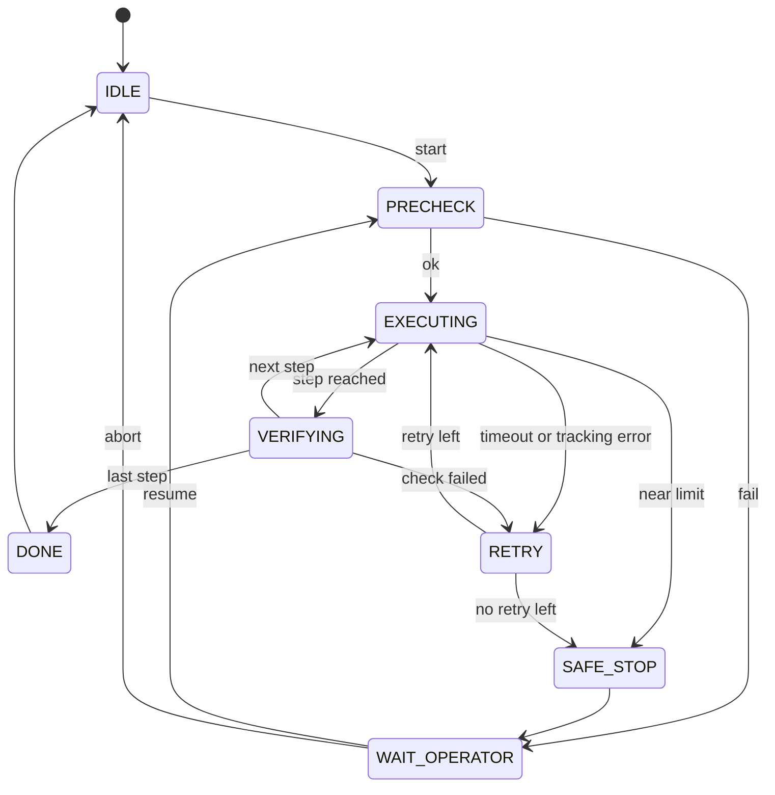

# 커리큘럼-커리어 정합 보정 설계 (2026-10-03 검토)

> 작성일: 2026-10-03
> 상태: Approved (2026-10-03 대화에서 확정). §0.2 에서 결정 기구가 "재평가 #1" 인 항목은 권고안이며 2026.11 분기 재평가 #1 에서 확정한다
> 대상: 2026.10-2027.02 운영 방식 (판단 게이트·학습 방식·시장 신호 수단), Hardware-Arm Stage 1 범위 (task supervisor 추가), 분기 재평가 #1 안건 (신규 5건 + 기존 4건 권고 부기), 레포 문서의 회사명 표기 규칙
> 사유: Physical AI 진입 회의 끝에 "2027.02 까지 현 계획 유지, 공부 방법만 변경" 으로 정리하면서, 현 커리큘럼이 실제 타깃 JD 에 기여하는지 공고 원문으로 검토했다 — 2026년분은 정합, 2027년분은 구 시간축 설계가 남아 있고, 공백 2개 (태스크 실행·복구, 코딩테스트 언어) 가 확인됐다
> 관련 분석: [KR Physical AI JD 조사](../../research/2026-08-31-kr-physical-ai-jd-survey.md), 9월 JD 정독 (`.private/jd/2026-09-jd-reading.md`)
> Plan: [`docs/superpowers/plans/2026-10-03-curriculum-career-fit.md`](../plans/2026-10-03-curriculum-career-fit.md) (문서 반영 Task 1-5, §5 카탈로그). 커리어 실행 항목 (W9 구현, LLM 없는 블록, 지인 질문, 판단 게이트 실행) 의 체크는 [master roadmap](../plans/2026-08-31-master-roadmap.md) 에서만 한다

## 목차

- §0 배경과 확정된 결정
- §1 현재 구조 진단 (공고 원문·레포 사실 기반)
- §2 판단 게이트 (2027.02 초)
- §3 task supervisor (Stage 1 W9)
- §4 LLM 없는 블록
- §5 로드맵 (Task 카탈로그)
- §6 검증 기준
- §7 리스크와 한계
- §8 의사결정 로그
- 부록 A 관련 파일

---

## 0. 배경과 확정된 결정

### 0.1 동기

| 시점 | 사건 |
|---|---|
| 2026-08-31 | master roadmap 확정. 목표 = FM 조직의 시스템 SW (로봇 학습 시스템) |
| 2026-09-01 | 지원 개시 기본선 = 복직 후 2027.05-06 확정. 12월부터 코테 준비 주 2h (C++ 문제 풀이) 확정 |
| 2026-09-20 | 스파이크 must 4개 통과 |
| 2026-10-01 | Stage 1 W1-W5 · W6-7 완료 (W6-7 잔여 1건), W8 은 v2.5 실기 영상으로 대체 |
| 2026-10-03 | Physical AI 진입 회의 제기 → 현 계획 유지 + 공부 방법 변경으로 정리, 공고 원문 기준 커리큘럼 검토 |

- 2026-10-03 에 세 가지 우려가 함께 나왔다 — Physical AI 조직에 들어갈 수 있는가, 익숙한 ROS 미들웨어를 벗어나는 두려움, 이직이 가족 안정성에 주는 영향. 대안으로 ROS 미들웨어 고도화도 검토했다.
- 결론은 "2027.02 까지 현 계획 유지, 공부 방법만 변경" 이다. 근거: 2027.02 까지 할 일은 어느 길이든 거의 같고 (Stage 1·v2.5·C++ 준비가 양쪽에 쓰인다), 진짜 분기는 2027.05 지원서의 전면 서사다.
- 유지의 전제로 "현 커리큘럼이 실제로 커리어에 기여하는가" 를 공고 원문으로 검토했다. 결과는 §1.
- 같은 회의가 근거 없이 반복되지 않도록 유지 기간 끝에 판단 기준을 둔다 — §2 판단 게이트.
- LLM 의존이 실력 소유감을 낮춘다는 문제가 함께 제기됐다. 이해를 내 것으로 만드는 항목 (자가 검증 10문항 → v1.5 소화) 이 두 번 스킵된 것이 레포에 남아 있다 — §4.

### 0.2 확정된 결정

| # | 항목 | 결정 | 결정 기구·시점 | 상세 |
|---|---|---|---|---|
| 1 | 실행 추적 | 이 spec 의 plan 은 문서 반영만 추적한다. 커리어 실행 항목은 master roadmap 에서만 체크한다 | 즉시 | §8.1 |
| 2 | 회사명 표기 | **비공개 레포 문서는 실명 허용**, vla-lab 등 공개 채널로 옮길 때만 익명화. 2026-07-20 career-review-sync spec §8.2 의 실명 금지를 대체한다 | 즉시 (사용자 결정) | §8.3 |
| 3 | task supervisor | **Stage 1 must W9 로 추가.** ROS2 독립 노드, soft_stop 재사용, v2.5 측정과 분리. 대상은 웨이포인트 기반 스크립트 pick-and-place | 즉시 (배치는 사용자 결정) | §3, §8.2 |
| 4 | 시장 신호 수단 | 커피챗 대신 **아는 사람 2-3명에게 구체 질문** (현 고용주와 연결된 사람 제외), 또는 로보티즈 AI 사피엔스 기여 1건 | 즉시 (사용자 결정) | §8.7 |
| 5 | LLM 없는 블록 | 메인 트랙 작업을 LLM 없이 하는 주 1회 1-2시간 블록. 새 트랙이 아니다 | 즉시 | §4, §8.9 |
| 6 | v1.5 소화 ② | 스킵 대장 예외로 부활 — 10월, v2.5 착수 전 30분 | 즉시 (사용자 결정) | §8.10 |
| 7 | 판단 게이트 | 2027.02 초 (초기 패키징 착수 전) 1회. 입력 5개 + 결정 규칙 | 즉시 등재 | §2, §8.8 |
| 8 | 성공 지표 | 첫 웨이브 서류 결과 (지원 수 대비 서류 통과) 를 2027.07 중간 확인과 재평가 #3 입력으로 쓴다 | 즉시 등재 | — |
| 9 | Phase 5 | 권고: 4주로 압축 + 주제 교체 (SmolVLA 구조, action chunking, flow matching, ACT-Diffusion-VLA 계보) | 재평가 #1 (master roadmap §5 안건 1 에 부기) | §1.2, §8.4 |
| 10 | Phase 6·7 지위 | 권고: 헤드라인 → 지원 중 강화 카드. 첫 서류의 실물은 v2.5 | 재평가 #1 (안건 3 에 부기) | §1.2, §8.5 |
| 11 | Stage 2 C++ 인터록 | 권고: Phase 7 지위와 독립적으로 C++ 실증 카드로 보존 | 재평가 #1 (신규 안건 9) | §1.2, §8.5 |
| 12 | 코딩테스트 언어 | 권고: 12월 코테 준비 언어를 JD 격차 매핑의 언어 열 집계로 다시 정한다. C++ 면접 방어는 별개 항목으로 유지. 2026-09-01 확정 (C++ 문제 풀이) 을 대체 | 재평가 #1 (안건 6 에 부기). 언어 확인은 10월 | §1.3, §8.6 |
| 13 | 서사 진열 순서 | 권고: 실기 로봇 → 정책 연동 → v2.5 데이터·평가 시스템 → 태스크 실행·복구. 양자화·latency 는 받침 | 재평가 #1 (안건 7 에 부기) | §1.1 |
| 14 | 부록 E fallback | 권고: 착지점을 "AMR/AV Perception·센서퓨전 SW" 에서 "로봇 시스템 SW" 로 재정의할지 판단 | 재평가 #1 (신규 안건 10) | §8.8 |
| 15 | 해제 시간 용도 | Phase 5 압축·Phase 6·7 강등으로 생기는 시간의 용도 — 후보: C++·DDS 집중 / 동역학 라잇 / Stage 2 C++ 인터록 / 지원 대응 버퍼 | 재평가 #1 (신규 안건 11) | §1.5 |
| 16 | 지원 회사 필터 | 안정성·통근·출장 비율을 숫자 기준으로 정한다. 배우자와 합의 후 확정 | 재평가 #1 (신규 안건 12) | §0.3 |
| 17 | 문서 분량 상한 | 권고: 의사결정 회차당 spec·plan 1쌍. 회차 사이의 변경은 master roadmap 결정 기록으로 | 재평가 #1 (신규 안건 13) | §7 |
| — | v2.5 범위 | **변경 없음** — 라이트 모드 유지 | — | §8.2 |
| — | `soft_stop.py` · 패키지 빌드 파일 | **변경 없음** — supervisor 는 soft_stop 을 서비스로 호출만 한다. 패키지 파일 추가는 W9 실행 시 | — | §3 |
| — | Stage 1 기존 가이드 (`ros2_driver_setup.md`, `URDF_guide.md`) | **변경 없음** | — | — |

### 0.3 이 설계가 보장하지 않는 것

- 커리큘럼 정합은 필요조건이다. 합격은 상대평가·완수율·면접 깊이가 정한다.
- §1.1 의 직무 해석은 RLWRLD 공고 2건 (2026-10-03 원문) 기반이다. 매핑 기준의 나머지 절반인 로보티즈 모방학습·네비게이션 공고는 원문 대조 전이다 (10월 JD 격차 매핑에서 대조).
- 기준 공고의 상당수가 시드 단계 스타트업이다. 회사 안정성은 이 설계가 해결하지 않으며 #16 지원 회사 필터 안건으로 넘긴다.
- task supervisor 가 서류 통과율을 올린다는 보장은 없다. AMR 애플리케이션에서 상태기계·예외 복구를 직접 설계해온 경력과 새 산출물을 잇는 근거를 하나 만드는 것이 목적이다.
- 판단 게이트의 결정 규칙 (§2.2) 은 2026-10 시점의 가정이다. 재평가 #1 에서 수정될 수 있다.
- 이 설계는 Physical AI 진입 여부를 결정하지 않는다. 그 판단은 §2 게이트와 2027 지원 결과가 한다.

---

## 1. 현재 구조 진단 (공고 원문·레포 사실 기반)

### 1.1 기준 JD 실측 (RLWRLD, 2026-10-03 원문)

[Applied Research Engineer, Robotics](https://realworld.career.greetinghr.com/en/o/227582) (Robotics Deployment 조직):

| 구분 | 내용 |
|---|---|
| 자격요건 | 실제 로봇·자율 시스템 경험 / ROS·ROS2 시스템 개발·운영 / 학습 정책 (VLA·IL) 의 실제 로봇 연동 경험 또는 이해 / 센서·카메라·액추에이터·제어 통합 / Python·C++·Bash 운영 도구·실험 자동화 |
| 필요 기술 (5개 중 2개 이상) | Robotics / Policy Learning / Task Planning & Execution (BT, FSM, motion planning) / Perception / Simulation |
| 주요 업무 중 해당 | 다단계 작업의 실행 흐름 설계, 실패 상황 예외 처리·복구 |
| 우대 | 매니퓰레이션 프로젝트 / 실험 환경·데이터 수집·평가 시스템 직접 구축 / 학습 모델의 실제 로봇 연동 |
| 학위 | 요건 없음 |
| 코딩테스트 | Python 고정, 프로그래머스, 2시간 ([채용 FAQ](https://realworld.career.greetinghr.com/en/joinus) — 전 직군 공통) |

같은 조직의 [Robotics Deployment Engineer](https://realworld.career.greetinghr.com/en/o/227583) 는 teleoperation, calibration, safety stop, monitoring 구축을 업무로 명시한다.

해석: 직함은 연구직이나 요구 내용은 시스템 통합 중심이다. 9월 정독에서 매핑 기준 공고가 Applied Research 쪽으로 바뀐 것을 두고 "현실 밴드가 얇을 수 있다" 는 우려가 2026-10-03 대화에서 나왔으나, 원문 기준으로 완화된다.

### 1.2 구간별 기여도

| 구간 | 기여 | 근거 | 판정 |
|---|---|---|---|
| 스파이크 + Stage 1 | 최상 | 자격요건 5개 중 4개 직접 증명 — 실제 로봇, ROS2, 센서·카메라·액추에이터 통합, Python·Bash 운영 도구. W4 캘리브레이션 · W5 soft stop 은 Deployment Engineer 업무 문구와 겹친다 | 유지 + W9 추가 (§3) |
| v2.5 | 최상 | 자격요건 5번째 (정책의 실기 연동) 와 우대 "데이터 수집·평가 시스템 구축" 정면 매칭. 첫 웨이브 서류의 실물 | 변경 없음 |
| v1.5 | 중상 | 하네스 검증·배제 분석 = 평가 설계 역량. ManiSkill sim eval 은 필요 기술 Simulation 의 근거가 될 수 있다. 약점: sim, 구세대 모델 | 유지 (발행 완료) |
| v1, Phase 3 | 중하 | 측정 방법론 증거, fallback 카드 | 유지 (받침) |
| Phase 5 | 하 | 확인한 기준 JD 에 인코더 원리 요구 없음. OpenVLA backbone (DINOv2 + SigLIP) 중심 구성이라 SmolVLA 전환 후 정합이 낮다 | 압축·교체 권고 (#9) |
| Phase 6 (v2) | 중 | Simulation 은 필요 기술 5개 중 1개이고 v1.5 가 일부 충족. 4070 에서 Isaac Sim 이 도는지는 Stage 1 nice 시도 전이라 미확정. 일정이 지원 기간과 겹친다 | 지위 재정의 권고 (#10) |
| Phase 7 (v3) | 첫 웨이브 기여 없음 | 완성 시점 (2027.08~) 이 지원 개시 이후 | 지위 재정의 권고 (#10) |
| Stage 2 | 중 | v3 선행으로 정의돼 있으나 C++ 안전 인터록 (`stage2/safety_interlock.md`) 은 [positioning spec](2026-08-05-career-positioning-vla-edge-design.md) §5.4 의 C++ 실증 카드다. W5 의 soft stop 은 Python 이라 이 카드를 대신하지 않는다 | C++ 인터록 보존 권고 (#11) |

### 1.3 공백

| 공백 | 내용 | 근거 |
|---|---|---|
| 태스크 실행·복구 | 필요 기술 Task Planning & Execution 과 주요 업무 "실패 상황 예외 처리·복구" 가 커리큘럼에 없다. AMR 애플리케이션에서 상태기계·예외 복구 로직을 직접 설계한 경력 (2026-10-03 사용자 확인) 이 직접 해당하는데, 그것을 매니퓰레이터에서 보여주는 산출물이 없다 | §1.1 |
| 코딩테스트 언어 | master roadmap 12월 코테 준비는 C++ 문제 풀이로 확정돼 있으나 RLWRLD 는 Python 고정이다. 코테 언어와 C++ 면접 방어 (RAII·스마트 포인터·동시성 설명) 는 별개 항목이다 | §1.1 |

### 1.4 검토에서 제외한 항목

| 항목 | 사유 |
|---|---|
| 데이터 인프라 서사 (양산 Docker·OTA 경험 연결) | 양산 Docker·OTA 개발에 참여하지 않았다 — 근거 없는 서사 (사용자 확인 2026-10-03) |
| PoC 리드 서사, 배포 직무의 현장 비중 | 사용자 결정으로 고려하지 않는다 (2026-10-03) |

v2.5 의 데이터 수집·평가 시스템은 본인 산출물이므로 §1.4 와 무관하게 서사에 포함한다.

### 1.5 시간 예산

기준: 9월 실투입 15.9h (09-01 - 09-20). 월 환산 24h (20일 기준) - 53h (작업한 9일 기준), 로드맵 가정 30-35h. 이 설계는 보수 기준 월 24h 로 계산한다.

| 구간 | 신규 부하 | 합계 | 판정 |
|---|---|---|---|
| 2026.10 | W9 supervisor 6-10h (타임박스 10h) + 지인 질문 1-2h + v1.5 소화 ② 0.5h + 로보티즈 원문 대조 1h. 문서 반영 (plan Task 1-4) 은 2026-10-03 세션에서 수행해 본인 부하가 아니다 | 8.5-13.5h | 수용 가능 — Stage 1 must 가 일정보다 한 달 앞서 끝나 10월 메인 트랙이 비어 있다 |
| 2026.11-12 | 재평가 #1 안건 5건 추가 (판단만) + plan Task 5 (2-4h) | 3-6h | 수용 가능 — v2.5 범위는 바뀌지 않는다 |
| 2027.03-04 | Phase 5 압축 (12주 → 4주) 으로 8주 분 해제 | 해제 44-64h (주 5.5-8h) | 용도는 #15 |
| 2027.05-11 | Phase 6·7 강등으로 일부 해제 | 미산정 | 지원 대응과 경합 — 재평가 #1 에서 산정 |

---

## 2. 판단 게이트 (2027.02 초)

시점: 2027.02 초, 초기 패키징 착수 전 (패키징 직후로 두면 이력서가 나온 뒤에 서사를 정하는 역순이 된다). 판단 대상: 첫 웨이브 지원서의 전면 서사. 포트폴리오는 어느 결과든 같다. 판정은 이날 한 번만 하고, 당일에는 규칙을 바꾸지 않는다.

### 2.1 입력

| ID | 입력 | 확인 방법 |
|---|---|---|
| I1 | v2.5 vla-lab 발행 여부 | vla-lab README 의 상태 열 |
| I2 | 아는 사람 2-3명의 답 — FM 조직의 시스템·통합·배포 엔지니어 수요, 면접 깊이, 내 서류의 해석 | `.private/` 에 한 줄씩 기록 |
| I3 | Stage 1 must (W9 포함) 완료 여부 | master roadmap §3 |
| I4 | v1.5·v2.5·supervisor 의 결정 근거를 자료 없이 각 1분 설명 가능 여부 | 소리 내어 1회, 막힌 지점 기록 |
| I5 | LLM 없는 블록을 지킨 주 수 | 월 실적 집계 표 |

"수요 확인" (I2) 은 "그 조직이 지금 이런 엔지니어를 뽑거나 뽑을 계획이다" 라는 답을 뜻한다. 일반론 ("로봇 업계가 커진다") 은 수요 확인으로 세지 않는다.

### 2.2 결정 규칙

| 조건 | 결과 |
|---|---|
| I1 발행 + I2 에서 수요 확인 1명 이상 | **A**: Physical AI 시스템 SW 전면 (현행 포지셔닝) |
| I1 발행 + I2 부정 또는 답 없음 | **C**: 회사별 분기 — FM 조직에는 A, 그 외 로봇 회사에는 B |
| I1 미발행 | **B**: 로봇 시스템 SW 전면, Physical AI 는 엣지. v2.5 완료 후 2차 웨이브에서 A 재시도 |
| 결과가 B 또는 C | C++·DDS 면접 방어 비중을 3-4월 준비에서 올린다 |
| I3 미달 | 결과와 무관하게 미완 must 를 지원 전 버퍼로 넘긴다 |
| I4 미달 | 결과와 무관하게 3-4월 면접 준비를 설명 리허설에 먼저 배정한다 |
| I5 | 서사 결정의 입력이 아니다 — 학습 방식을 유지할지 바꿀지의 입력이다 |

### 2.3 운영

- 등재 위치: master roadmap §2 일정표 (게이트 열) + §3 체크리스트 (입력 수집 I1-I5), README 부록 D 표. 결정 규칙의 원본은 이 절이다.
- 결과 기록: master roadmap 결정 기록에 결과 (A/B/C) 와 입력 5개의 값을 남긴다.

---

## 3. task supervisor (Stage 1 W9)

### 3.1 목적

AMR 애플리케이션에서 설계해온 상태기계·예외 복구 패턴을 매니퓰레이터 태스크 실행에 옮겨, 필요 기술 Task Planning & Execution 과 주요 업무 "실패 상황 예외 처리·복구" 의 직접 근거를 만든다 (§1.3).

### 3.2 배치와 범위

- ROS2 독립 노드. `bringup.launch.py` 에 넣지 않고 따로 띄운다 — bringup 을 띄울 때마다 태스크가 시작될 위험을 없앤다.
- LeRobot 스택과 v2.5 측정에서 분리한다. 대상 작업은 정책이 아니라 웨이포인트 기반 스크립트 pick-and-place 다 (§8.2).
- 정지·해제는 W5 의 `soft_stop.py` 에 위임한다. 소프트 리밋·토크 상한은 기존 설정에 맡기고 재정의하지 않는다.
- 구현 가이드 (파일·명령·시험 절차·확정값 기록 표): [`Studies/Hardware-Arm/stage1/task_supervisor.md`](../../../Studies/Hardware-Arm/stage1/task_supervisor.md).

### 3.3 인터페이스 (기존 이름 재사용)

| 방향 | 이름 | 타입 | 비고 |
|---|---|---|---|
| 구독 | `/joint_states` | `sensor_msgs/JointState` | 감지의 유일한 입력. 버스를 추가로 읽지 않는다 |
| 구독 | `/robot_description` | `std_msgs/String` (transient local) | 한계값을 URDF `<limit>` 에서 한 번 읽는다 — 값을 두 곳에 두지 않는다. 하드웨어 읽기가 아니다 |
| 발행 | `/position_controller/commands` | `std_msgs/Float64MultiArray` | `soft_stop.py` 의 `COMMAND_ORDER` 순서 |
| 호출 | `/soft_stop/stop`, `/soft_stop/release` | `std_srvs/Trigger` | 정지·해제는 soft_stop 에 위임 |
| 제공 | `~/start`, `~/resume`, `~/abort` | `std_srvs/Trigger` | 운영자 조작 |
| 발행 | `~/state` | `std_msgs/String` | 상태 전이 로그. Foxglove 로 본다 |

### 3.4 상태 전이

- PRECHECK: `/joint_states` 수신 확인, soft_stop 해제 상태 확인 (필요하면 `/soft_stop/release`), 현재 위치로 명령 기준점을 다시 맞춘다
- RETRY: 단계별 `retry_from` 지점으로 돌아가 1회 재시도한다
- SAFE_STOP: `/soft_stop/stop` 을 호출한 뒤 WAIT_OPERATOR 로 간다

### 3.5 감지 조건 (초기값)

초기값은 이 절이 원본이고, mock·실기 1차 실행 후의 확정값은 구현 가이드의 기록 표에 남긴다.

| 조건 | 초기값 | 근거 |
|---|---|---|
| 단계 타임아웃 | 5 s | 보간 속도 0.5 rad/s (§3.7) 로 2.5 rad 이동 |
| 추종 오차 | 정착 1.0 s 뒤 0.08 rad 초과 | W5 처짐 실측 0.02 rad 이하 대비 여유 |
| 파지 실패 | 닫힘 명령 뒤 gripper 가 -0.80 rad 미만 (빈 손 닫힘 실측 -0.867) | W4 실측 |
| 한계 근접 | 소프트 리밋 0.03 rad 이내 | W5 리밋 값 기준 |

- 파지 단계 (`check: grasp`) 의 gripper 관절은 추종 오차 검사에서 뺀다 — 물체를 쥐면 gripper 는 명령값에 닿지 않는 것이 정상이다.

### 3.6 웨이포인트

파일 `config/task_waypoints.yaml` (패키지의 `config/` 는 이미 설치 대상이다). 단계마다 다음 필드를 둔다.

| 필드 | 뜻 |
|---|---|
| `name` | 단계 이름 (예: approach, grasp, lift, place, release, retreat) |
| `positions` | 관절 6개 목표 (rad, `COMMAND_ORDER` 순서) |
| `timeout_s` | 단계 타임아웃 (§3.5 초기값을 덮어쓸 때만) |
| `check` | `none` / `tracking` / `grasp` |
| `retry_from` | RETRY 때 돌아갈 단계 이름 |

값은 teleop 으로 자세를 잡은 뒤 `Studies/Hardware-Arm/stage1/scripts/print_joint_command.py` 로 읽어 기록한다.

### 3.7 제약

- 명령은 50 Hz 보간으로 보낸다. 틱당 관절 변화는 최대 0.01 rad (0.5 rad/s). 출발점은 항상 `/joint_states` 의 현재 위치다 — `ros2_driver_setup.md` §4.2 의 "첫 명령은 지금 위치 그대로 + 조금" 규칙을 보간이 자동으로 지킨다.
- 실기 시험은 W5 안전 기초가 켜진 bringup 에서, 낮은 자세로 한다.

### 3.8 시험

| 환경 | 시나리오 | 통과 기준 |
|---|---|---|
| mock | 정상 흐름 (grasp 단계 `check: none` 으로 바꾼 파일) | IDLE → … → DONE → IDLE |
| mock | 타임아웃 주입 (한 단계 `timeout_s: 0.1`) | RETRY 1회 → SAFE_STOP → WAIT_OPERATOR |
| mock | 파지 실패 (mock 은 명령값을 그대로 돌려줘 빈 손 닫힘이 항상 재현된다) | RETRY 1회 → SAFE_STOP → WAIT_OPERATOR |
| mock | resume / abort | PRECHECK 재진입 / IDLE 복귀 |
| mock | 한계 근접 (한 관절 목표를 소프트 리밋 밖으로 — 리미터가 한계값으로 자른다) | RETRY 없이 SAFE_STOP |
| 실기 | 정상 3회 | DONE 3/3 |
| 실기 | 큐브를 치운 뒤 실행 3회 | 파지 실패 감지 → RETRY 1회 → SAFE_STOP → WAIT_OPERATOR 3/3 |
| 실기 | WAIT_OPERATOR 에서 resume 1회 | PRECHECK 재동기화 뒤 튐 없이 재개 |

### 3.9 최소선과 타임박스

- 최소선: 감지 → SAFE_STOP → WAIT_OPERATOR. RETRY 는 완성선이다.
- 구현이 10h 를 넘으면 RETRY 를 잘라 최소선으로 마감한다. 판정은 W9 착수 후 10h 시점에 한 번만 한다.

### 3.10 증거

상태 전이 로그 (`~/state` 를 기록한 bag 또는 텍스트) + 짧은 영상 클립. v2.5 1분 영상의 정지 시연 장면에 넣을지는 v2.5 발행 시 고른다 (v2.5 범위 변경이 아니다). 면접 서사는 "AMR 에서 설계해온 상태기계·복구 패턴을 매니퓰레이터로 옮겼다" 이다.

---

## 4. LLM 없는 블록

| 규칙 | 내용 |
|---|---|
| 정의 | 메인 트랙 작업을 하는 방식이다. 새 트랙이 아니므로 경량 병행 상한 (최대 2개) 에 들어가지 않는다 |
| 빈도 | 주 1회 1-2시간 |
| 블록 중 | LLM 을 쓰지 않는다. 공식 문서·소스 코드·책은 쓴다 |
| 막혔을 때 | 가설을 적어 두고 블록을 계속한다. 블록이 끝난 뒤 LLM 에는 답이 아니라 "내 가설 검증" 을 묻는다 |
| 첫 4주 과제 | task supervisor 의 상태기계 핵심 로직 — 직접 설계해온 영역이라 혼자 붙잡기에 맞다 |
| 이후 후보 | W6-7 잔여 25-30 ms 출처 판별 — 블록 3회 상한 |
| 기록 | 월 실적 집계 표의 "LLM 없는 블록 h" 열에 주별로 적는다 (10월분부터) |
| 다음 규칙 | 4주 유지되면 "막히면 15-20분 혼자 → 가설 기록 → LLM" 을 블록 밖 작업에도 적용한다 |

---

## 5. 로드맵 (Task 카탈로그)

| Task | 목적 | 핵심 산출물 | 선행 조건 | plan 섹션 |
|---|---|---|---|---|
| 1 | spec·plan 배치, 2026-10-03 결정 기록, 회사명 규칙 교체 | 이 spec + plan, master roadmap 결정 기록, supersede 주석 4곳 | 없음 | Task 1 |
| 2 | 운영 변경 반영 | master roadmap 의 게이트·시장 신호·JD 매핑·v1.5 소화·코테·LLM 블록, README 부록 D 게이트 | Task 1 | Task 2 |
| 3 | supervisor 를 Stage 1 범위에 추가 | `task_supervisor.md`, stage1 README W9, master roadmap W9, Hardware-Arm.md · README Stage 1 문구 | Task 1 | Task 3 |
| 4 | 재평가 #1 안건 등재 | master roadmap §5 신규 안건 9-13 + 기존 1·3·6·7 부기, README 부록 D 2026.11 행 | Task 1 | Task 4 |
| 5 | 재평가 #1 결정 전파 | Phase 5·6·7, stage2 README, README 타임라인·부록 B·부록 E·포지셔닝 | 재평가 #1 (2026.11 하순) | Task 5 (Draft — 재평가 후 세부화) |

---

## 6. 검증 기준

| ID | 기준 |
|---|---|
| D1 | 판단 게이트가 master roadmap (§2 일정표 + §3 체크리스트) 과 README 부록 D 양쪽에 있고, 둘 다 이 spec §2 를 가리킨다 |
| D2 | 회사명 금지 규칙을 서술하는 문서 4개 (2026-07-20 spec·plan, 2026-08-05 spec, 2026-08-31 research) 에 supersede 주석이 있다 |
| D3 | master roadmap §5 에 신규 안건 9-13 이 각각 한 번씩 있고, 기존 안건 1·3·6·7 에 권고가 부기돼 있으며, §3 재평가 체크 줄의 안건 범위가 1-13 이다 |
| D4 | W9 (task supervisor) 가 stage1 README, `Roadmap/Hardware-Arm.md`, README Stage 1, master roadmap §3 네 곳에 같은 이름으로 있다 |
| D5 | (Task 5 후) v2·v2.5 지위 표기와 Phase 5 기간이 README gantt · 타임라인 표 · `Roadmap/Phase 5·6·7.md` 에서 일치한다 |
| T1 | plan 에 커리어 실행 체크박스가 없다 — W9 구현·LLM 블록·지인 질문·게이트 입력은 master roadmap 에만 있다 |
| S1 | `Studies/Hardware-Arm/v25/` 에 변경이 없다 |
| S2 | `so101_description` 패키지 (`soft_stop.py`, `CMakeLists.txt`, `package.xml`, launch) 에 변경이 없다 — 구현 파일은 W9 실행 시 추가한다 |
| S3 | supervisor 설계에 `/joint_states` 외의 하드웨어 읽기가 없다 |
| L1 | 월 실적 집계에 LLM 없는 블록 h 가 10월분부터 기록된다 |
| L2 | 첫 웨이브 서류 결과를 2027.07 에 확인한다 (#8) |

---

## 7. 리스크와 한계

**문서 과잉**: 이 설계도 문서를 늘린다 (spec·plan·가이드 1개). 커리어에 실제로 기여하는 것은 vla-lab 공개물과 머릿속 이해다. #17 문서 분량 상한을 재평가 #1 에 올린 이유다.

**10월 부하**: §1.5 는 보수 기준 월 24h 에서 8.5-13.5h 를 더한다. 9월처럼 첫 열흘이 비면 W9 가 v2.5 착수를 밀 수 있다 — 그 경우 W9 를 최소선 (§3.9) 으로 마감하고 v2.5 를 우선한다.

**게이트 규칙의 단순성**: I2 는 2-3명의 답이라 표본이 작다. 결정 규칙은 "어느 서사를 앞에 두는가" 만 정하고 지원 여부는 정하지 않으므로, 오판 비용은 서류 몇 건의 서사 차이로 한정된다.

**롤백**

| 상황 | 대응 |
|---|---|
| 문서 반영이 잘못됨 | Task 단위 커밋이므로 해당 커밋만 `git revert` |
| supervisor 구현이 10h 초과 | RETRY 를 잘라 최소선으로 마감 (§3.9). 판정은 10h 시점 1회 |
| 게이트 규칙이 현실과 맞지 않음 | 재평가 #1 에서 규칙을 고친다. 게이트 당일에는 고치지 않는다 |

---

## 8. 의사결정 로그

### 8.1 실행 추적: 이 plan 의 보드 vs master roadmap
- **옵션 A (비채택)**: 이 plan 을 커리어 실행의 진행 보드로 쓴다 — master roadmap 이 이미 유일한 실행 보드로 선언돼 있어 보드가 두 개가 된다
- **옵션 B (채택)**: plan 은 문서 반영만, 커리어 실행은 master roadmap 에서만 추적
- **사유**: 기존 실행 보드 구조 유지, 이중 체크 방지

### 8.2 supervisor 배치: v2.5 실행기 vs ROS2 독립 노드
- **옵션 A (비채택)**: v2.5 실행기에 FSM — v2.5 는 성공을 사람이 판정해야 하고, FSM 의 조기 종료가 모델 간 결과 분류를 바꿀 수 있으며, 매 틱 부하 읽기가 28.5 Hz 루프를 바꿀 수 있고, v2.5 라이트 모드 ("새 검증 체계를 만들지 않는다") 와 충돌한다
- **옵션 B (채택, 사용자 결정)**: ROS2 독립 노드, soft_stop 재사용, 스크립트 작업 감독, Stage 1 W9
- **옵션 C (비채택)**: Stage 2/v3 로 미룬다 — 첫 웨이브 서류에 들어가지 않는다
- **옵션 D (비채택)**: 넣지 않는다 — 직접 설계해온 상태기계 경력과 JD 필요 기술을 잇는 근거가 비어 있다
- **사유**: 측정 무결성과 라이트 모드를 지키면서 ROS2 기반 태스크 실행 근거를 첫 웨이브 전에 만든다. 대가: 정책 연동 서사는 v2.5 가 따로 맡는다

### 8.3 회사명 표기: 실명 금지 유지 vs 비공개 레포 실명 허용
- **옵션 A (비채택)**: 실명 금지 유지 + master roadmap 익명화 — master roadmap 과 9월 정독 체크박스가 이미 실명을 쓰고 있어 고치는 비용이 들고, 비공개 레포에서 실익이 작다
- **옵션 B (채택, 사용자 결정)**: 비공개 레포는 실명 허용, 공개 채널 이관 시 익명화
- **사유**: 현행 관행과 일치. 노출 위험은 공개 채널로 옮기는 시점에 관리한다

### 8.4 Phase 5: 유지 vs 폐지 vs 압축
- **옵션 A (비채택)**: 12주 유지 — 기준 JD 에 요구가 없고 2027 상반기가 과적재된다
- **옵션 B (비채택)**: 폐지 — 모델 구조 질문에 대한 면접 방어가 비게 된다
- **옵션 C (권고)**: 기존 안건 범위 4-6주 중 하한 4주 + 현행 모델 구조로 주제 교체. 하한인 이유: 목적이 면접 방어뿐이다

### 8.5 Phase 6·7 · Stage 2
- **옵션 A (비채택)**: Phase 6·7 헤드라인 유지 — 완성이 첫 웨이브 이후이고, Simulation 근거는 v1.5 가 일부 충족한다
- **옵션 B (비채택)**: 폐기 — 2차 웨이브 강화 카드의 가치는 남는다
- **옵션 C (권고)**: 지원 중 강화 카드로 재정의. Stage 2 의 C++ 안전 인터록은 Phase 7 지위와 독립적으로 보존한다 (C++ 실증 카드, 오늘 대안으로 검토한 "로봇 시스템 SW" 서사와도 직결)

### 8.6 코딩테스트 언어
- **옵션 A (비채택)**: C++ 고정 (2026-09-01 확정안) — RLWRLD 는 Python 고정이다
- **옵션 B (비채택)**: Python 고정 — 다른 타깃의 언어를 아직 확인하지 않았다
- **옵션 C (채택)**: 타깃별 언어를 10월 JD 격차 매핑에서 확인한 뒤 재평가 #1 에서 비중 결정. C++ 면접 방어는 별도로 유지

### 8.7 시장 신호 수단
- **옵션 A (비채택)**: 현직자 커피챗 — 본인에게 부담이 가장 크다
- **옵션 B (채택, 사용자 결정)**: 아는 사람 2-3명에게 구체 질문. 휴직 중 저가시성 원칙에 따라 현 고용주와 연결된 사람은 제외
- **옵션 C (병행 가능)**: 로보티즈 AI 사피엔스 코드 정독 + 이슈·기여 1건

### 8.8 판단 게이트와 fallback
- **옵션 A (비채택)**: 게이트 없이 지원 시점에 판단 — 같은 회의가 근거 없이 반복된다
- **옵션 B (비채택)**: 초기 패키징 직후 — 이력서가 나온 뒤 서사를 정하는 역순
- **옵션 C (채택)**: 2027.02 초 패키징 착수 전, 입력 5개와 결정 규칙 (§2) 으로 1회
- 부록 E fallback (AMR/AV Perception·센서퓨전 SW) 은 게이트 결과 B 의 착지점 (로봇 시스템 SW) 과 다르고, 센서 경험이 데이터 소비 수준이라 더 약한 착지점일 수 있다 — 재정의 여부를 재평가 #1 에서 판단한다 (#14)

### 8.9 학습 방식
- **옵션 A (비채택)**: 현행 유지 — 이해를 내 것으로 만드는 항목이 두 번 스킵됐다
- **옵션 B (비채택)**: 별도 학습 트랙 신설 — 경량 병행 상한 위반
- **옵션 C (채택)**: 메인 트랙 작업을 LLM 없이 하는 블록으로 운용. 한 번에 한 가지 규칙만 바꾼다

### 8.10 v1.5 소화 ② 부활 시점
- **옵션 A (비채택)**: 재평가 #1 안건으로만 — 30분짜리 항목에 두 달을 기다린다
- **옵션 B (채택, 사용자 결정)**: 스킵 대장 예외로 즉시, 사유를 스킵 대장에 부기

### 8.11 제외 항목
- 데이터 인프라 서사: 양산 Docker·OTA 미참여로 근거 없음 (사용자 확인)
- PoC 리드 서사·배포 직무 현장 비중: 사용자 결정으로 고려하지 않음

---

## 부록 A: 관련 파일

### A.1 수정
- `docs/superpowers/plans/2026-08-31-master-roadmap.md` — 결정 기록, 일정표 게이트, W9, 병행·상시 항목, 코테 supersede, 스킵 대장 예외, 재평가 안건 (Task 1-4)
- `Studies/Hardware-Arm/stage1/README.md` — W9 must 행·절·체크리스트 (Task 3)
- `Roadmap/Hardware-Arm.md` — Stage 1 목표·단계·체크리스트에 W9 (Task 3), 재평가 후 Stage 2 (Task 5)
- `README.md` — Stage 1 목표 (Task 3), 부록 D 게이트·2026.11 안건 (Task 2·4), 재평가 후 타임라인·부록 B·부록 E·포지셔닝 (Task 5)
- `docs/superpowers/specs/2026-07-20-career-review-sync-design.md`, `docs/superpowers/plans/2026-07-20-career-review-sync.md`, `docs/superpowers/specs/2026-08-05-career-positioning-vla-edge-design.md`, `docs/research/2026-08-31-kr-physical-ai-jd-survey.md` — 회사명 규칙 supersede 주석만 (Task 1)
- `Roadmap/Phase 5.md`, `Roadmap/Phase 6.md`, `Roadmap/Phase 7.md`, `Studies/Hardware-Arm/stage2/README.md` — 재평가 후 (Task 5)

### A.3 신규
- `docs/superpowers/specs/2026-10-03-curriculum-career-fit-design.md` — 이 문서
- `docs/superpowers/plans/2026-10-03-curriculum-career-fit.md` — 문서 반영 plan
- `Studies/Hardware-Arm/stage1/task_supervisor.md` — W9 구현 가이드
- (W9 실행 시, 이 설계의 문서 반영 범위 밖) `stage1/ros2_pkg/so101_description/scripts/task_supervisor.py`, `config/task_waypoints.yaml`, `CMakeLists.txt` 의 install 한 줄, `package.xml` 의 `python3-yaml` exec_depend 한 줄

### A.4 변경 없음 (의도적 보존)
- `Studies/Hardware-Arm/v25/README.md`, `PRACTICE.md` — v2.5 라이트 모드 유지
- `Studies/Hardware-Arm/stage1/ros2_pkg/so101_description/` 전체 — W9 실행 전까지
- `Studies/Hardware-Arm/stage1/ros2_driver_setup.md`, `URDF_guide.md` — 판단에 영향 없음
- `Measurements/` — 기존 실측 보존
- vla-lab — v2.5 발행 시점에만 갱신

### A.5 외부 자산
- RLWRLD [Applied Research Engineer, Robotics](https://realworld.career.greetinghr.com/en/o/227582) / [Robotics Deployment Engineer](https://realworld.career.greetinghr.com/en/o/227583) / [채용 FAQ](https://realworld.career.greetinghr.com/en/joinus) — 2026-10-03 확인
